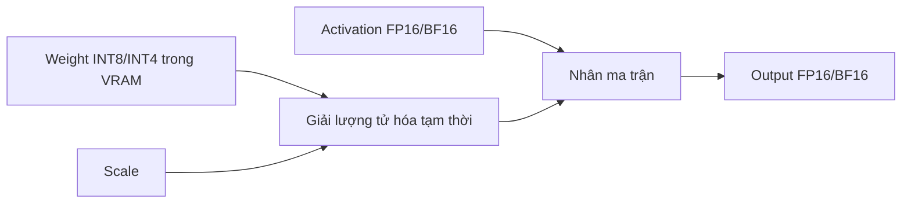
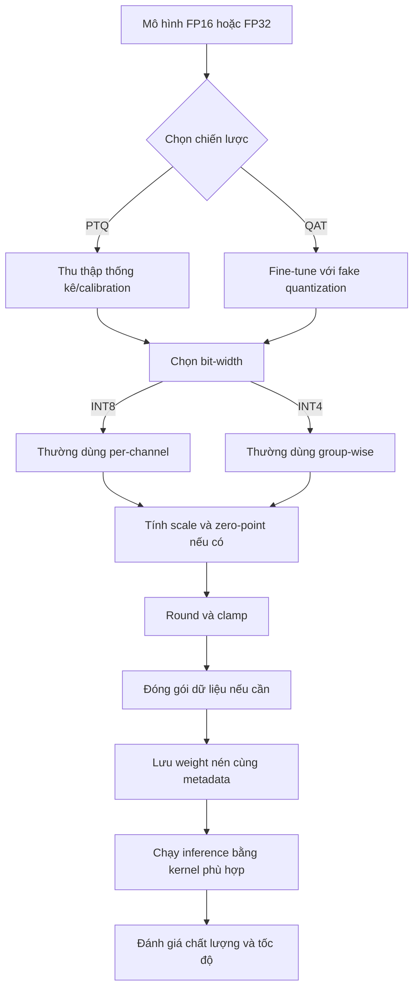

# Quantization dễ hiểu: Từ FP32 đến INT8 và INT4

> Một bài hướng dẫn đi từ trực giác, công thức đến mã Python để hiểu cách mô hình AI được nén xuống 8-bit hoặc 4-bit.

## Mục lục

1. [Quantization là gì?](#1-quantization-là-gì)
2. [Tại sao mô hình AI cần quantization?](#2-tại-sao-mô-hình-ai-cần-quantization)
3. [FP32 lưu một con số như thế nào?](#3-fp32-lưu-một-con-số-như-thế-nào)
4. [Ý tưởng cốt lõi: đổi từ số thực sang các ô số nguyên](#4-ý-tưởng-cốt-lõi-đổi-từ-số-thực-sang-các-ô-số-nguyên)
5. [Scale và Zero-point thực sự có ý nghĩa gì?](#5-scale-và-zero-point-thực-sự-có-ý-nghĩa-gì)
6. [Công thức quantization và dequantization](#6-công-thức-quantization-và-dequantization)
7. [Ví dụ tính tay từ FP32 sang INT8](#7-ví-dụ-tính-tay-từ-fp32-sang-int8)
8. [Cài đặt symmetric INT8 bằng NumPy](#8-cài-đặt-symmetric-int8-bằng-numpy)
9. [Weights-only quantization là gì?](#9-weights-only-quantization-là-gì)
10. [Vì sao outlier có thể phá hỏng quantization?](#10-vì-sao-outlier-có-thể-phá-hỏng-quantization)
11. [Per-tensor, per-channel và group-wise](#11-per-tensor-per-channel-và-group-wise)
12. [Quantization 4-bit hoạt động như thế nào?](#12-quantization-4-bit-hoạt-động-như-thế-nào)
13. [Đóng gói hai số 4-bit vào một byte](#13-đóng-gói-hai-số-4-bit-vào-một-byte)
14. [PTQ và QAT khác nhau ra sao?](#14-ptq-và-qat-khác-nhau-ra-sao)
15. [Toàn bộ pipeline nhìn trong một sơ đồ](#15-toàn-bộ-pipeline-nhìn-trong-một-sơ-đồ)
16. [Những hiểu lầm thường gặp](#16-những-hiểu-lầm-thường-gặp)
17. [Bài thực hành nhỏ](#17-bài-thực-hành-nhỏ)
18. [Tóm tắt kiến thức](#18-tóm-tắt-kiến-thức)

---

## 1. Quantization là gì?

**Quantization**, hay **lượng tử hóa**, là kỹ thuật biểu diễn các con số có độ chính xác cao bằng một tập số nhỏ hơn.

Trong mô hình AI, trọng số thường được lưu bằng:

- `FP32`: mỗi trọng số dùng 32 bit.
- `FP16`: mỗi trọng số dùng 16 bit.
- `INT8`: mỗi trọng số dùng 8 bit.
- `INT4`: mỗi trọng số dùng 4 bit.

Hãy tưởng tượng bạn có một chiếc thước đo rất chi tiết:

```text
0.000, 0.001, 0.002, 0.003, ...
```

Chiếc thước này đo chính xác, nhưng cần rất nhiều vạch.

Quantization giống như đổi sang chiếc thước ít vạch hơn:

```text
0.0, 0.1, 0.2, 0.3, ...
```

Ta tiết kiệm không gian, nhưng phải chấp nhận rằng một số giá trị sẽ được làm tròn.

Ví dụ:

```text
Giá trị thật:       1.23
Giá trị sau nén:    1.20
Sai số:             0.03
```

Điều quan trọng không phải là loại bỏ hoàn toàn sai số. Mục tiêu là:

> Giảm bộ nhớ thật nhiều nhưng giữ sai số đủ nhỏ để mô hình vẫn hoạt động tốt.

---

## 2. Tại sao mô hình AI cần quantization?

Một mô hình ngôn ngữ có thể chứa hàng tỷ trọng số. Mỗi trọng số chỉ là một con số, nhưng khi số lượng lên đến hàng tỷ, bộ nhớ cần thiết trở nên rất lớn.

### Ví dụ với mô hình 7 tỷ tham số

Cách tính gần đúng:

```text
Bộ nhớ = số tham số × số byte cho mỗi tham số
```

| Định dạng | Bit/trọng số | Byte/trọng số | Bộ nhớ lý thuyết cho 7B tham số |
|---|---:|---:|---:|
| FP32 | 32 | 4 | khoảng 28 GB |
| FP16 | 16 | 2 | khoảng 14 GB |
| INT8 | 8 | 1 | khoảng 7 GB |
| INT4 | 4 | 0.5 | khoảng 3.5 GB |

> Các con số trên chỉ tính phần trọng số. Khi chạy thực tế, chương trình còn cần bộ nhớ cho activation, KV cache, buffer và các metadata khác.

Quantization giúp giải quyết hai vấn đề lớn:

### 2.1. Giảm dung lượng mô hình

Mô hình nhỏ hơn sẽ:

- dễ lưu trên ổ cứng hơn;
- dễ tải xuống hơn;
- có thể chạy trên GPU ít VRAM hơn;
- có cơ hội chạy trên laptop hoặc thiết bị biên.

### 2.2. Giảm lượng dữ liệu phải chuyển trong GPU

Khi suy luận, GPU liên tục đọc trọng số từ VRAM để thực hiện phép nhân ma trận.

Nếu trọng số nhỏ hơn, lượng dữ liệu cần truyền cũng nhỏ hơn.

Trong nhiều trường hợp, tốc độ suy luận không chỉ bị giới hạn bởi khả năng tính toán. Nó còn bị giới hạn bởi tốc độ đưa trọng số từ bộ nhớ đến nhân xử lý.

---

## 3. FP32 lưu một con số như thế nào?

Một số `FP32` sử dụng 32 bit, được chia thành ba phần:

| Thành phần | Số bit | Vai trò |
|---|---:|---|
| Sign | 1 | Cho biết số âm hay dương |
| Exponent | 8 | Điều khiển độ lớn của số |
| Mantissa/Fraction | 23 | Giữ phần chi tiết của số |

Cách biểu diễn này giúp FP32 chứa được:

- số rất nhỏ;
- số rất lớn;
- số thập phân khá chính xác.

Ví dụ, số `3.5` trong hệ nhị phân là:

```text
3.5 = 11.1₂
```

Chuẩn hóa theo dạng khoa học nhị phân:

```text
1.11 × 2¹
```

Từ đó FP32 lưu:

```text
[sign] [exponent] [mantissa]
[  0 ] [10000000] [11000000000000000000000]
```

Bạn không cần ghi nhớ cách chuyển đổi từng bit để hiểu quantization.

Điều cần nhớ là:

> FP32 rất linh hoạt và chính xác, nhưng mỗi số tốn 32 bit.

Trong khi đó, `INT8` chỉ là một số nguyên nằm trong khoảng:

```text
-128 đến 127
```

INT8 không có exponent và mantissa. Vì vậy, muốn chuyển FP32 sang INT8, ta cần tạo một phép ánh xạ.

---

## 4. Ý tưởng cốt lõi: đổi từ số thực sang các ô số nguyên

Giả sử một nhóm trọng số nằm trong khoảng:

```text
-3.5 đến 3.5
```

Trong khi INT8 có 256 giá trị có thể sử dụng:

```text
-128, -127, ..., 0, ..., 126, 127
```

Ta có thể tưởng tượng 256 số nguyên này là 256 **chiếc hộp**.

Mỗi số thực sẽ được đặt vào chiếc hộp gần nó nhất.

```text
Thế giới số thực:  -3.5 ------------------------------- 3.5
                       ↓ chia thành các bước nhỏ ↓
Thế giới INT8:     -128 ------------------------------- 127
```

Vì số hộp là hữu hạn, nhiều số thực gần nhau có thể rơi vào cùng một hộp.

Ví dụ:

```text
0.51  ─┐
       ├──> cùng được biểu diễn bằng số nguyên 2
0.58  ─┘
```

Đây chính là nguồn gốc của **quantization error**, tức sai số lượng tử hóa.

---

## 5. Scale và Zero-point thực sự có ý nghĩa gì?

Quantization thường được điều khiển bởi hai tham số:

- **Scale**, ký hiệu `S`.
- **Zero-point**, ký hiệu `Z`.

### 5.1. Scale là kích thước của một bước

Scale trả lời câu hỏi:

> Khi số nguyên tăng thêm 1, giá trị trong thế giới số thực thay đổi bao nhiêu?

Giả sử miền số thực là:

```text
[-3.5, 3.5]
```

Có hai cách nhìn thường gặp:

**Affine quantization tổng quát** dùng cả độ rộng miền float và miền integer:

```text
S = (x_max - x_min) / (q_max - q_min)
S = 7.0 / 255 ≈ 0.02745
```

**Symmetric quantization** buộc tâm của hai miền trùng tại số 0 và thường chọn:

```text
S = max(|x|) / 127
S = 3.5 / 127 ≈ 0.02756
```

Hai kết quả khá gần nhau trong ví dụ đối xứng này, nhưng chúng đến từ hai cách thiết lập miền khác nhau. Phần mã phía dưới sử dụng cách symmetric với `S = abs_max / 127`.

Nghĩa là một bước trong INT8 tương ứng khoảng `0.02756` ở miền số thực.

Bạn có thể hình dung:

```text
INT8 tăng 1 đơn vị
        ↓
FP32 tăng khoảng 0.02745
```

### 5.2. Zero-point là vị trí của số 0

Zero-point trả lời câu hỏi:

> Giá trị float `0.0` sẽ được biểu diễn bằng số nguyên nào?

Nếu miền dữ liệu đối xứng quanh 0, ta thường chọn:

```text
Z = 0
```

Cách này được gọi là **symmetric quantization**.

Ví dụ:

```text
-3.5 -------- 0.0 -------- 3.5
-127 --------  0  -------- 127
```

Đối với trọng số mô hình, symmetric quantization rất phổ biến vì:

- công thức đơn giản;
- không cần lưu zero-point khác 0;
- phép tính trên phần cứng dễ tối ưu hơn.

---

## 6. Công thức quantization và dequantization

### 6.1. Quantization: float → integer

Công thức tổng quát:

\[
q = \operatorname{clamp}
\left(
\operatorname{round}\left(\frac{x}{S} + Z\right),
q_{\min},
q_{\max}
\right)
\]

Trong đó:

- `x`: giá trị float ban đầu;
- `S`: scale;
- `Z`: zero-point;
- `round`: làm tròn về số nguyên gần nhất;
- `clamp`: chặn kết quả để không vượt khỏi miền số nguyên;
- `q`: giá trị sau quantization.

Với symmetric quantization, `Z = 0`, công thức rút gọn thành:

\[
q = \operatorname{clamp}
\left(
\operatorname{round}\left(\frac{x}{S}\right),
q_{\min},
q_{\max}
\right)
\]

### 6.2. Dequantization: integer → float xấp xỉ

Công thức:

\[
\hat{x} = S(q - Z)
\]

Ký hiệu `x̂` không phải là số ban đầu chính xác. Nó là giá trị **xấp xỉ được dựng lại**.

```text
x   = giá trị ban đầu
x̂  = giá trị gần đúng sau khi nén rồi giải nén
```

Sai số:

\[
\text{error} = x - \hat{x}
\]

### Vì sao phải có `clamp`?

Giả sử một phép tính cho ra `q = 150`, nhưng INT8 chỉ chứa tối đa `127`.

Khi đó:

```text
clamp(150, -128, 127) = 127
```

Nếu không chặn, giá trị có thể bị tràn số và cho kết quả sai hoàn toàn.

---

## 7. Ví dụ tính tay từ FP32 sang INT8

Cho:

```text
x = 1.2
S = 0.02745
Z = 0
```

### Bước 1: Chia cho scale

```text
1.2 / 0.02745 ≈ 43.72
```

### Bước 2: Cộng zero-point

```text
43.72 + 0 = 43.72
```

### Bước 3: Làm tròn

```text
round(43.72) = 44
```

### Bước 4: Clamp

`44` vẫn nằm trong `[-128, 127]`, nên giữ nguyên.

Kết quả:

```text
1.2 trong FP32  →  44 trong INT8
```

### Dựng lại giá trị float

```text
x̂ = S × (q - Z)
x̂ = 0.02745 × 44
x̂ ≈ 1.2078
```

Sai số:

```text
1.2 - 1.2078 = -0.0078
```

Ta đã đổi một số float 32-bit thành số nguyên 8-bit, nhưng vẫn giữ được giá trị gần với ban đầu.

### Bảng minh họa

Với tensor:

```python
[1.2, -3.5, 0.8, 2.1, -1.9, 3.5]
```

ta có kết quả gần đúng:

| Float ban đầu | INT8 | Float dựng lại | Sai số gần đúng |
|---:|---:|---:|---:|
| 1.2 | 44 | 1.213 | -0.013 |
| -3.5 | -127 | -3.500 | 0.000 |
| 0.8 | 29 | 0.799 | 0.001 |
| 2.1 | 76 | 2.094 | 0.006 |
| -1.9 | -69 | -1.902 | 0.002 |
| 3.5 | 127 | 3.500 | 0.000 |

Các con số có thể thay đổi một chút tùy cách chọn scale và quy tắc làm tròn.

---

## 8. Cài đặt symmetric INT8 bằng NumPy

Đoạn mã dưới đây được viết lại để xử lý cả trường hợp tensor chỉ chứa số 0.

```python
import numpy as np


def symmetric_quantize_int8(
    fp32_tensor: np.ndarray,
) -> tuple[np.ndarray, float]:
    """
    Chuyển một tensor float sang INT8 bằng symmetric quantization.

    Trả về:
        quantized_tensor: tensor INT8
        scale: hệ số dùng để dựng lại giá trị gần đúng
    """
    fp32_tensor = np.asarray(fp32_tensor, dtype=np.float32)

    q_min = -128
    q_max = 127

    abs_max = float(np.max(np.abs(fp32_tensor)))

    # Tránh chia cho 0 khi toàn bộ tensor đều bằng 0.
    if abs_max == 0.0:
        quantized_tensor = np.zeros_like(fp32_tensor, dtype=np.int8)
        return quantized_tensor, 1.0

    scale = abs_max / q_max

    quantized_tensor = np.round(fp32_tensor / scale)
    quantized_tensor = np.clip(
        quantized_tensor,
        q_min,
        q_max,
    ).astype(np.int8)

    return quantized_tensor, scale


def dequantize_symmetric_int8(
    quantized_tensor: np.ndarray,
    scale: float,
) -> np.ndarray:
    """Dựng lại tensor float xấp xỉ từ INT8."""
    return quantized_tensor.astype(np.float32) * scale


weights = np.array(
    [1.2, -3.5, 0.8, 2.1, -1.9, 3.5],
    dtype=np.float32,
)

quantized_weights, scale = symmetric_quantize_int8(weights)
restored_weights = dequantize_symmetric_int8(
    quantized_weights,
    scale,
)

print("Trọng số ban đầu:")
print(weights)

print("\nScale:")
print(scale)

print("\nTrọng số INT8:")
print(quantized_weights)

print("\nTrọng số dựng lại:")
print(np.round(restored_weights, 4))

print("\nSai số tuyệt đối:")
print(np.round(np.abs(weights - restored_weights), 4))
```

### Điều gì đang xảy ra trong mã?

```python
abs_max = np.max(np.abs(fp32_tensor))
```

Tìm giá trị có độ lớn lớn nhất.

Ví dụ:

```text
[-3.5, 2.1, 1.2]
→ lấy trị tuyệt đối: [3.5, 2.1, 1.2]
→ abs_max = 3.5
```

```python
scale = abs_max / 127
```

Chọn scale để giá trị lớn nhất gần chạm biên `127`.

```python
np.round(fp32_tensor / scale)
```

Đưa mỗi số float về một vị trí trong lưới số nguyên.

```python
np.clip(..., -128, 127)
```

Bảo đảm mọi giá trị đều hợp lệ trong INT8.

```python
.astype(np.int8)
```

Chuyển kiểu dữ liệu thật sự sang INT8.

---

## 9. Weights-only quantization là gì?

Trong một lớp neural network, phép tính quan trọng thường có dạng:

\[
Y = XW
\]

Trong đó:

- `X`: input hoặc activation;
- `W`: weight;
- `Y`: output.

### 9.1. Weight giống “kiến thức dài hạn”

Weight:

- được học trong quá trình training;
- gần như không thay đổi khi inference;
- chiếm phần lớn dung lượng của mô hình;
- được đọc đi đọc lại ở mỗi lần chạy.

### 9.2. Activation giống “dòng thông tin đang xử lý”

Activation:

- phụ thuộc vào prompt hiện tại;
- thay đổi theo từng token và từng layer;
- được tạo ra rồi tiếp tục truyền qua mạng;
- không phải toàn bộ đều được giữ lâu như weight.

### 9.3. Lựa chọn phổ biến

Trong **weights-only quantization**:

```text
Weights      → INT8 hoặc INT4
Activations  → FP16/BF16
```

Đây là một dạng **mixed precision** vì mô hình dùng nhiều định dạng số cùng lúc.

### 9.4. Dòng dữ liệu đơn giản hóa



Quá trình có thể hiểu như sau:

1. Weight được lưu ở dạng nén trong VRAM.
2. GPU đọc weight cùng scale.
3. Weight được chuyển thành giá trị xấp xỉ phù hợp cho kernel tính toán.
4. Phép nhân ma trận được thực hiện.
5. Giá trị tạm không cần được lưu thành một bản FP16 đầy đủ trong VRAM.

### Ghi chú quan trọng

Dequantization **không khôi phục trọng số gốc một cách hoàn hảo**.

Ví dụ:

```text
Weight ban đầu:      1.2000
Weight dựng lại:     1.2078
```

GPU tính toán bằng giá trị đã được dựng lại hoặc bằng kernel hỗn hợp tương đương. Lợi ích chính đến từ:

- giảm bộ nhớ lưu weight;
- giảm băng thông đọc weight;
- tận dụng kernel/phần cứng được tối ưu.

Tốc độ thực tế còn phụ thuộc vào GPU, CPU, kernel và định dạng quantization cụ thể.

---

## 10. Vì sao outlier có thể phá hỏng quantization?

**Outlier** là giá trị có độ lớn vượt trội so với phần còn lại.

Xét tensor:

```python
[1.2, -3.5, 0.8, 2.1, -1.9, 1000.0]
```

Nếu dùng một scale cho toàn bộ tensor:

```text
abs_max = 1000
scale = 1000 / 127 ≈ 7.87
```

Bây giờ thử quantize các giá trị nhỏ:

```text
1.2 / 7.87 ≈ 0.15  → làm tròn thành 0
0.8 / 7.87 ≈ 0.10  → làm tròn thành 0
-1.9 / 7.87 ≈ -0.24 → làm tròn thành 0
```

Một giá trị `1000` đã khiến các giá trị nhỏ bị dồn về 0.

```text
Trước quantization:
[1.2, -3.5, 0.8, 2.1, -1.9, 1000.0]

Sau quantization:
[0, 0, 0, 0, 0, 127]
```

Thông tin quan trọng gần như biến mất.

Vấn đề không nằm ở công thức. Vấn đề nằm ở việc:

> Một scale đang phải phục vụ một nhóm số có độ lớn quá khác nhau.

Giải pháp là chia tensor thành các vùng nhỏ hơn, rồi tính scale riêng cho từng vùng.

---

## 11. Per-tensor, per-channel và group-wise

**Granularity** mô tả phạm vi mà một scale được dùng chung.

Granularity càng mịn:

- sai số thường càng nhỏ;
- outlier bị cô lập tốt hơn;
- nhưng phải lưu nhiều scale hơn.

### 11.1. Per-tensor

Một scale cho toàn bộ tensor.

```text
┌────────────────────────────┐
│                            │
│      Toàn bộ ma trận       │  dùng chung S
│                            │
└────────────────────────────┘
```

Ưu điểm:

- đơn giản;
- ít metadata;
- dễ triển khai.

Nhược điểm:

- rất nhạy với outlier;
- một giá trị lớn có thể làm giảm độ chính xác của cả tensor.

### 11.2. Per-channel

Mỗi hàng hoặc mỗi output channel có scale riêng.

```text
Hàng 1: [ ... ... ... ... ]  → S₁
Hàng 2: [ ... ... ... ... ]  → S₂
Hàng 3: [ ... ... ... ... ]  → S₃
```

Ví dụ:

```python
import numpy as np

weights = np.array(
    [
        [1.2, -0.5, 2.8, 0.9],
        [-1.5, 1000.0, 0.3, -2.1],
        [3.1, -2.2, -1.8, 1.1],
    ],
    dtype=np.float32,
)

abs_max_per_channel = np.max(
    np.abs(weights),
    axis=1,
)

scales = abs_max_per_channel / 127.0

print(scales)
```

Kết quả gần đúng:

```text
[0.022, 7.874, 0.024]
```

Outlier `1000` chỉ làm scale của hàng thứ hai trở nên lớn. Hai hàng còn lại vẫn giữ scale nhỏ và độ phân giải tốt.

Per-channel thường là lựa chọn hiệu quả cho INT8.

### 11.3. Group-wise

Mỗi hàng tiếp tục được chia thành các nhóm nhỏ.

```text
Một hàng trọng số:

[ nhóm 1 ][ nhóm 2 ][ nhóm 3 ][ nhóm 4 ]
    S₁        S₂        S₃        S₄
```

Group size phổ biến có thể là:

```text
32, 64 hoặc 128 trọng số/nhóm
```

Ví dụ với group size bằng 4:

```text
[0.1, 0.2, 0.3, 0.4] [0.2, 0.1, 50.0, 0.3]
         S₁                       S₂
```

Giá trị `50.0` chỉ ảnh hưởng đến nhóm thứ hai.

Group-wise đặc biệt quan trọng khi dùng 4-bit vì INT4 chỉ có rất ít mức số nguyên để biểu diễn dữ liệu.

### So sánh

| Cách chia | Số scale | Khả năng chống outlier | Metadata | Thường dùng |
|---|---:|---:|---:|---|
| Per-tensor | Ít nhất | Thấp | Thấp | Trường hợp đơn giản |
| Per-channel | Nhiều hơn | Tốt | Trung bình | INT8 |
| Group-wise | Nhiều nhất | Rất tốt | Cao hơn | INT4 |

Quy luật dễ nhớ:

> Bit càng thấp thì thường cần chia nhóm càng nhỏ để giữ chất lượng.

---

## 12. Quantization 4-bit hoạt động như thế nào?

INT4 chỉ có 16 trạng thái.

Nếu dùng dạng có dấu đối xứng, ta thường làm việc với miền gần như:

```text
-8 đến 7
```

Trong ví dụ symmetric đơn giản, scale có thể được tính bằng:

\[
S = \frac{\max(|x|)}{7}
\]

So với INT8 có khoảng 256 trạng thái, 4-bit chỉ có 16 trạng thái. Vì thế mỗi “bậc thang” lớn hơn nhiều.

### Ví dụ

```python
weights = [0.51, 0.58, -1.2, 2.1]
```

Giá trị lớn nhất:

```text
abs_max = 2.1
```

Scale:

```text
S = 2.1 / 7 = 0.3
```

Quantize:

```text
0.51 / 0.3 = 1.70  → 2
0.58 / 0.3 = 1.93  → 2
-1.2 / 0.3 = -4.0  → -4
2.1 / 0.3 = 7.0    → 7
```

Kết quả:

```text
[2, 2, -4, 7]
```

Hai số khác nhau là `0.51` và `0.58` đã trở thành cùng một giá trị.

Đây không phải lỗi của chương trình. Đây là giới hạn tự nhiên của việc chỉ dùng 4 bit.

### Mã minh họa

```python
import numpy as np

weights_group = np.array(
    [0.51, 0.58, -1.2, 2.1],
    dtype=np.float32,
)

q_min = -8
q_max = 7

abs_max = np.max(np.abs(weights_group))
scale = abs_max / q_max

quantized = np.round(weights_group / scale)
quantized = np.clip(
    quantized,
    q_min,
    q_max,
).astype(np.int8)

restored = quantized.astype(np.float32) * scale

print("Ban đầu:", weights_group)
print("Scale:", scale)
print("INT4 biểu diễn tạm bằng int8:", quantized)
print("Dựng lại:", restored)
```

Trong NumPy, ta dùng `int8` để chứa các giá trị `[-8, 7]` cho tiện thao tác. Điều đó chưa tự động tạo ra mức tiết kiệm 4-bit.

Để thật sự tiết kiệm bộ nhớ, ta còn phải **đóng gói bit**.

---

## 13. Đóng gói hai số 4-bit vào một byte

Một byte có 8 bit:

```text
[b7 b6 b5 b4 b3 b2 b1 b0]
```

Mỗi số 4-bit chỉ cần bốn vị trí:

```text
Nửa trái:  [b7 b6 b5 b4]
Nửa phải:  [b3 b2 b1 b0]
```

Vì vậy, một byte có thể chứa hai số 4-bit.

### Bước 1: Chuyển miền có dấu sang miền không dấu

Giả sử giá trị INT4 nằm trong:

```text
[-8, 7]
```

Ta cộng 8 để đưa về:

```text
[0, 15]
```

Ví dụ:

```text
 2 + 8 = 10  → 1010₂
-4 + 8 = 4   → 0100₂
```

### Bước 2: Đưa một số vào bốn bit cao

```python
second << 4
```

Nếu `second = 4`:

```text
00000100
dịch trái 4 bit
01000000
```

### Bước 3: Ghép hai nửa bằng phép OR

```python
packed = (second << 4) | first
```

Ví dụ:

```text
second << 4 = 01000000
first       = 00001010
OR          = 01001010
```

`01001010₂` bằng `74` trong hệ thập phân.

### Mã đóng gói và giải nén

```python
def int4_to_uint4(value: int) -> int:
    """Đổi giá trị [-8, 7] thành [0, 15]."""
    if not -8 <= value <= 7:
        raise ValueError("Giá trị INT4 phải nằm trong [-8, 7].")
    return value + 8


def uint4_to_int4(value: int) -> int:
    """Đổi giá trị [0, 15] trở lại [-8, 7]."""
    if not 0 <= value <= 15:
        raise ValueError("Giá trị UINT4 phải nằm trong [0, 15].")
    return value - 8


def pack_two_int4(first: int, second: int) -> int:
    """
    Đóng gói hai số INT4 vào một byte.

    first nằm ở 4 bit thấp.
    second nằm ở 4 bit cao.
    """
    first_u = int4_to_uint4(first)
    second_u = int4_to_uint4(second)

    return (second_u << 4) | first_u


def unpack_two_int4(packed: int) -> tuple[int, int]:
    """Lấy lại hai số INT4 từ một byte."""
    if not 0 <= packed <= 255:
        raise ValueError("Byte phải nằm trong [0, 255].")

    first_u = packed & 0b00001111
    second_u = (packed >> 4) & 0b00001111

    return (
        uint4_to_int4(first_u),
        uint4_to_int4(second_u),
    )


packed = pack_two_int4(2, -4)
first, second = unpack_two_int4(packed)

print("Byte đã đóng gói:", packed)
print(f"Dạng nhị phân: {packed:08b}")
print("Hai số lấy lại:", first, second)
```

Kết quả:

```text
Byte đã đóng gói: 74
Dạng nhị phân: 01001010
Hai số lấy lại: 2 -4
```

Trong mô hình thực tế, dữ liệu thường gồm:

```text
Mảng byte đã đóng gói
+
Mảng scale cho từng channel/group
+
Có thể có zero-point hoặc metadata khác
```

Do đó, mô hình 4-bit không phải lúc nào cũng đúng bằng chính xác `0.5 byte × số tham số`. Scale và metadata làm kích thước thực tế lớn hơn một chút.

---

## 14. PTQ và QAT khác nhau ra sao?

Quantization có thể được áp dụng sau khi mô hình đã train xong hoặc được mô phỏng ngay trong lúc train.

## 14.1. PTQ — Post-Training Quantization

PTQ nghĩa là:

> Train mô hình trước, quantize sau.

Pipeline đơn giản:

```text
Mô hình FP16/FP32 đã train
        ↓
Thu thập thống kê hoặc hiệu chỉnh
        ↓
Tính scale/zero-point
        ↓
Chuyển weight sang INT8/INT4
        ↓
Đánh giá chất lượng
```

### Calibration là gì?

Calibration không phải là train lại toàn bộ mô hình.

Ta cho một tập dữ liệu đại diện chạy qua mô hình để quan sát:

- phạm vi giá trị;
- phân bố activation;
- ảnh hưởng của outlier;
- cách chọn scale phù hợp.

Không phải mọi phương pháp weights-only đều dùng calibration theo cùng một cách, nhưng ý tưởng chung là dùng một lượng dữ liệu nhỏ để quyết định cách quantize tốt hơn.

### Ưu điểm

- nhanh hơn nhiều so với train lại;
- không cần pipeline huấn luyện đầy đủ;
- chi phí thấp;
- là điểm bắt đầu hợp lý cho phần lớn bài toán quantize LLM.

### Hạn chế

Mô hình không được học để tự thích nghi với sai số làm tròn.

Nếu một trọng số quan trọng bị thay đổi nhiều, PTQ không tự động điều chỉnh các trọng số khác để bù lại.

---

## 14.2. QAT — Quantization-Aware Training

QAT nghĩa là:

> Mô phỏng quantization trong quá trình train hoặc fine-tune.

Trong forward pass:

```text
Weight FP32
    ↓
Fake quantize
    ↓
Fake dequantize
    ↓
Weight FP32 đã mang sai số lượng tử hóa
    ↓
Tính output và loss
```

“Fake” ở đây có nghĩa là:

- weight vẫn được giữ ở dạng float để phục vụ cập nhật gradient;
- nhưng forward pass cố tình mô phỏng việc làm tròn và giới hạn miền số.

Nhờ đó, mô hình có thể học cách điều chỉnh trọng số để giảm ảnh hưởng của quantization.

### Ưu điểm

- có thể giữ chất lượng tốt hơn khi PTQ làm giảm hiệu năng quá nhiều;
- hữu ích cho mô hình nhạy với sai số;
- phù hợp khi yêu cầu độ chính xác rất nghiêm ngặt.

### Hạn chế

- cần dữ liệu;
- cần fine-tuning/training;
- tốn thời gian và tài nguyên hơn;
- pipeline phức tạp hơn.

### Bảng lựa chọn

| Tiêu chí | PTQ | QAT |
|---|---|---|
| Thời điểm quantize | Sau training | Trong training/fine-tuning |
| Chi phí | Thấp hơn | Cao hơn |
| Độ phức tạp | Dễ hơn | Khó hơn |
| Mô hình học thích nghi với sai số | Không | Có |
| Nên thử đầu tiên cho LLM | Có | Chỉ khi cần |

Quy tắc thực tế:

> Hãy bắt đầu bằng PTQ. Chỉ cân nhắc QAT khi đã đo được rằng PTQ làm giảm chất lượng ở mức không thể chấp nhận.

---

## 15. Toàn bộ pipeline nhìn trong một sơ đồ



Khi triển khai một mô hình thật, ta không nên chỉ hỏi:

```text
Mô hình đã nhỏ hơn chưa?
```

Ta cần đo ít nhất ba yếu tố:

1. **Dung lượng**: giảm được bao nhiêu VRAM hoặc RAM?
2. **Chất lượng**: độ chính xác, perplexity hoặc kết quả tác vụ thay đổi thế nào?
3. **Tốc độ**: token/giây có thực sự tăng trên phần cứng đang dùng không?

Một mô hình ít bit hơn không tự động đồng nghĩa với nhanh hơn trên mọi thiết bị. Phần cứng và kernel phải hỗ trợ tốt định dạng đó.

---

## 16. Những hiểu lầm thường gặp

### Hiểu lầm 1: “Dequantization lấy lại chính xác FP32 ban đầu”

Không đúng.

Dequantization chỉ tạo ra giá trị xấp xỉ:

```text
x → q → x̂
```

Thông thường:

```text
x̂ ≠ x
```

### Hiểu lầm 2: “Đổi mảng NumPy sang int8 là đã có mô hình INT4”

Không đúng.

Nếu các giá trị INT4 được chứa trong kiểu `int8`, mỗi phần tử vẫn chiếm 8 bit. Muốn thật sự đạt 4 bit, cần đóng gói hai giá trị vào một byte hoặc dùng định dạng/kernel chuyên dụng.

### Hiểu lầm 3: “Càng ít bit thì lúc nào cũng càng tốt”

Không đúng.

Giảm bit giúp tiết kiệm bộ nhớ nhưng có thể:

- tăng sai số;
- làm giảm chất lượng;
- cần thêm metadata;
- không tăng tốc nếu phần cứng không hỗ trợ.

### Hiểu lầm 4: “Một scale cho cả mô hình là đủ”

Thường không đủ, đặc biệt khi có outlier.

INT8 thường cần ít nhất granularity tốt như per-channel. INT4 thường cần group-wise để giữ chất lượng.

### Hiểu lầm 5: “Quantize weight là không còn tính toán float”

Không hẳn.

Nhiều hệ thống lưu weight ở INT8/INT4 nhưng vẫn sử dụng activation hoặc accumulation ở FP16, BF16, FP32 hay kiểu hỗn hợp tùy kernel.

### Hiểu lầm 6: “Kích thước INT4 luôn chính xác bằng một phần tư FP16”

Đó chỉ là ước lượng cho dữ liệu weight thô.

Kích thước thực tế còn có:

- scale;
- zero-point nếu dùng;
- thông tin nhóm;
- padding;
- định dạng file;
- tensor không được quantize.

---

## 17. Bài thực hành nhỏ

### Bài 1: Quan sát sai số INT8

Cho tensor:

```python
weights = np.array(
    [0.12, 0.37, -0.91, 1.45, -2.7],
    dtype=np.float32,
)
```

Hãy:

1. tìm `abs_max`;
2. tính scale;
3. quantize sang INT8;
4. dequantize;
5. tính sai số tuyệt đối trung bình.

Gợi ý:

```python
mean_error = np.mean(
    np.abs(weights - restored_weights)
)
```

### Bài 2: Thêm một outlier

Thêm `100.0` vào tensor trên rồi chạy lại.

Quan sát:

- scale thay đổi thế nào?
- các giá trị nhỏ có bị dồn về cùng một số nguyên không?
- sai số trung bình tăng bao nhiêu?

### Bài 3: So sánh per-tensor và per-channel

Tạo ma trận:

```python
weights = np.array(
    [
        [0.2, -0.8, 1.1, 0.4],
        [0.3, 100.0, -0.2, 0.5],
        [1.5, -1.2, 0.7, -0.9],
    ],
    dtype=np.float32,
)
```

Thực hiện:

- một scale cho toàn ma trận;
- một scale cho mỗi hàng.

Sau đó so sánh sai số của hàng 1 và hàng 3.

Bạn sẽ thấy outlier ở hàng 2 ít ảnh hưởng đến các hàng khác khi dùng per-channel.

### Bài 4: Viết hàm quantize INT4 theo nhóm

Yêu cầu:

```python
def quantize_int4_groupwise(
    weights: np.ndarray,
    group_size: int,
):
    ...
```

Hàm cần:

1. chia mảng thành các nhóm;
2. tính scale cho từng nhóm;
3. quantize mỗi nhóm vào `[-8, 7]`;
4. lưu scale;
5. dựng lại tensor để đo sai số.

### Bài 5: Kiểm tra hàm pack/unpack

Thử tất cả cặp giá trị trong `[-8, 7]`:

```python
for first in range(-8, 8):
    for second in range(-8, 8):
        packed = pack_two_int4(first, second)
        restored = unpack_two_int4(packed)

        assert restored == (first, second)
```

Nếu không có lỗi, hàm đóng gói và giải nén hoạt động đúng cho toàn bộ miền INT4.

---

## 18. Tóm tắt kiến thức

### Công thức cốt lõi

Quantization:

\[
q = \operatorname{clamp}
\left(
\operatorname{round}\left(\frac{x}{S} + Z\right),
q_{\min},
q_{\max}
\right)
\]

Dequantization:

\[
\hat{x} = S(q - Z)
\]

### Ý nghĩa

```text
Scale      = độ lớn của một bước lượng tử hóa
Zero-point = vị trí số nguyên đại diện cho float 0
Round      = đưa số vào ô gần nhất
Clamp      = không cho vượt miền hợp lệ
```

### Ba mức granularity

```text
Per-tensor  → một scale cho toàn tensor
Per-channel → một scale cho mỗi channel/hàng
Group-wise  → một scale cho từng nhóm nhỏ
```

### Quy luật thực tế

```text
INT8 → thường phù hợp với per-channel
INT4 → thường cần group-wise
```

### Hai chiến lược triển khai

```text
PTQ → quantize sau khi train, nhanh và nên thử trước
QAT → mô phỏng quantization khi train, đắt hơn nhưng có thể giữ chất lượng tốt hơn
```

### Điều quan trọng nhất

Quantization luôn là một bài toán đánh đổi giữa:

```text
Bộ nhớ  ↔  Tốc độ  ↔  Chất lượng
```

Không có cấu hình tốt nhất cho mọi mô hình và mọi thiết bị. Một cấu hình phù hợp phải được kiểm tra bằng số liệu thực tế trên:

- đúng mô hình;
- đúng tác vụ;
- đúng phần cứng;
- đúng runtime/kernel.

---

## Nguồn và phạm vi

README này được biên soạn lại bằng tiếng Việt từ tài liệu `quantization.md`, với cách tổ chức, ví dụ và lời giải thích mới dành cho người đang học nền tảng AI.

Nội dung tập trung vào các nguyên lý:

- affine quantization;
- scale và zero-point;
- weights-only quantization;
- outlier và granularity;
- INT8, INT4 và bit packing;
- PTQ và QAT.

Đây là tài liệu học nguyên lý, không phải hướng dẫn sử dụng riêng cho một thư viện quantization cụ thể.
