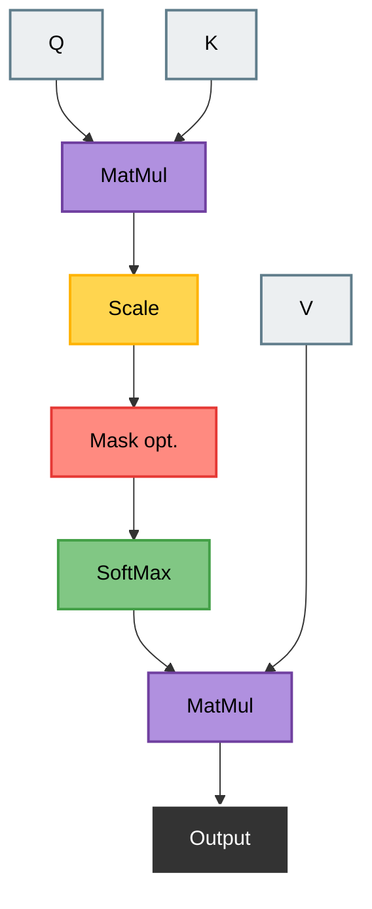
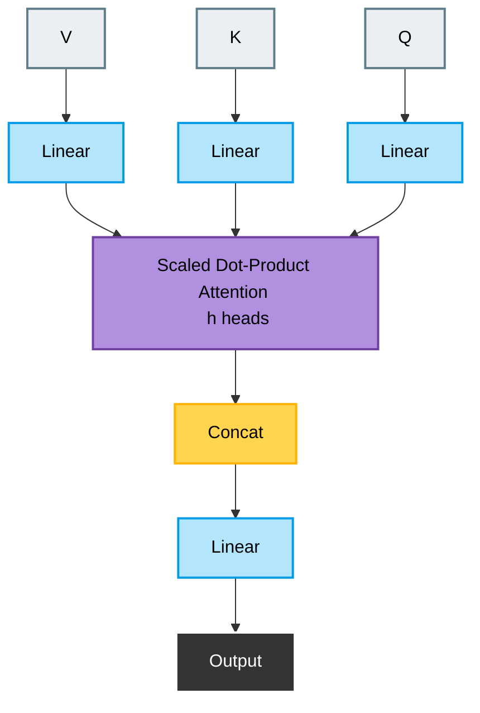

# Attention Thật Đơn Giản

### I. Giới thiệu: Vấn đề của LLM khi không có Attention

Giả sử bạn đang đọc câu sau: `"Con báo đang đuổi theo con mồi trên đồng cỏ"`

Và câu này: `"Bản báo cáo tài chính quý này quá phức tạp."`

Cả hai câu đều có từ "báo" nhưng ở mỗi câu, bộ não của chúng ta lại tự động liên tưởng đến một ý nghĩa hoàn toàn khác nhau nhờ vào các từ xung quanh nó.

Từ "báo" trong câu đầu (động vật) hoàn toàn khác với từ "báo" trong câu thứ hai (tài liệu). Đối với máy móc, đây là một vấn đề lớn. Làm thế nào mà máy móc có thể hiểu ý nghĩa các từ lân cận?

Cơ chế Attention chính là cách mà máy tính bắt chước bộ não của con người, nó tính toán xem một từ cần phải "chú ý" đến những từ nào khác xung quanh để hiểu đúng ngữ cảnh của chính nó.

Trong các chương tiếp theo bạn sẽ hiểu chính xác cách thức hoạt động của các thành phần sau:

- Các từ nhúng (Word Embeddings): Điểm khởi đầu cố định cho mỗi từ.
- Chú ý tích vô hướng được mở rộng (Scaled Dot-Product Attention): Công thức cốt lõi cho phép tạo ngữ cảnh.
- Truy vấn (Query), Khóa (Key) và Giá trị (Value) (QKV): Ba vai trò mà một từ có thể đảm nhiệm.
- Mặt nạ nhân quả (Causal Mask): Làm thế nào để ngăn chặn mô hình gian lận bằng cách nhìn trước tương lai.
- Cơ chế chú ý đa đầu (Multi-Head Attention): Làm thế nào để mở rộng cơ chế này cho các mô hình mạnh mẽ.


**Scaled Dot-Product Attention**

| Thành phần | Vai trò |
| :--- | :--- |
| MatMul ($QK^T$) | Tính độ liên quan |
| Scale | Ổn định số học |
| Mask | Chặn tương lai |
| Softmax | Biến thành xác suất |
| MatMul ($QK^T$ x V) | Lấy thông tin |

### 1. Scaled Dot-Product Attention

Công thức cốt lõi này và các đoạn mã ở những chương sau là xương sống của các mô hình như ChatGPT, Gemini,.v.v.

$$\text{Attention}(Q, K, V) = \text{softmax}\left(\frac{QK^T}{\sqrt{d_k}}\right)V$$

### II. Giải thích toán học và trực giác

**Biến ngôn ngữ thành những con số:**

Trong toán học hình học, để máy tính hiểu được một từ, người ta biến từ đó thành một vector (bạn có thể tưởng tượng nó như một mũi tên xuất phát từ gốc tọa độ $(0,0)$ trong hệ trục tọa độ).
Ví dụ bằng một không gian 2 chiều gồm trục $(X, Y)$:
- Trục $X$: Đại diện cho yếu tố "Động vật" (càng gần 1 là càng thuộc về động vật, càng gần 0 là không phải).
- Trục $Y$: Đại diện cho yếu tố "Hành động săn mồi" (càng gần 1 là càng liên quan đến săn mồi, càng gần 0 là không).

Bây giờ, chúng ta thử đặt 3 từ sau vào không gian này dưới dạng các điểm tọa độ $(X, Y)$:
- Từ "báo" (con báo) có tọa độ là $(0.9, 0.9)$ vì nó vừa là động vật, vừa săn mồi rất giỏi.
- Từ "con mồi" có tọa độ là $(0.85, 0.1)$ vì nó là động vật nhưng không phải là kẻ đi săn mồi.
- Từ "bài báo" (tờ báo giấy) có tọa độ là $(0.0, 0.0)$ vì nó không phải động vật cũng không đi săn.

Nếu bạn vẽ các mũi tên từ gốc tọa độ $(0,0)$ đến 3 điểm này, bạn sẽ thấy mũi tên của từ "báo" và từ "con mồi" tạo với nhau một góc khá nhọn (chúng chỉa về hướng tương tự nhau trên trục động vật). Trong khi đó, mũi tên của "bài báo" lại nằm xa hẳn.

Trong hình học, để biết hai mũi tên (vector) có đang chỉ về cùng một hướng hay không, người ta thường đo góc giữa hai mũi tên đó.

Khi góc giữa hai mũi tên bằng $0^\circ$ (tức là chúng hoàn toàn trùng nhau và chỉ về cùng một hướng), thì giá trị của $\cos(0^\circ)$ sẽ bằng 1. Khi giá trị $\cos$ của góc giữa hai vector tiến gần về $1$, điều đó có nghĩa là hai vector đó đang chỉ về cùng một hướng (hoặc góc giữa chúng rất nhỏ). Trong AI, chúng ta gọi đây là độ tương đồng Cosine (Cosine Similarity).

Bây giờ hãy ráp nối hình học này vào cơ chế Attention:
- Khi mô hình LLM thấy từ "báo" và từ "con mồi" có hai vector chỉ về hướng gần nhau (góc nhỏ, $\cos$ gần bằng $1$), máy tính sẽ hiểu: "À, hai từ này có sự liên quan lớn với nhau trong không gian ý nghĩa!"
- Ngược lại, vector của từ "báo" và từ "bài báo" sẽ tạo với nhau một góc lớn hơn ( $\cos$ sẽ gần bằng $0$), nghĩa là chúng ít liên quan đến nhau hơn trong ngữ cảnh này.Để máy tính tính toán được điều này một cách tự động cho hàng triệu từ cùng một lúc, các nhà khoa học không chỉ dùng một vector cho mỗi từ, mà họ chia mỗi từ thành 3 mũi tên (vector) chức năng khác nhau, gọi tắt là Q, K, và V.
- Trong máy tính, để làm việc với hàng ngàn từ cùng một lúc, người ta không tính toán từng cặp vector mà gộp tất cả các vector của các từ lại thành một bảng số lớn, gọi là Ma trận

Ba mũi tên chức năng (Q, K, V) thực chất là viết tắt của:

- Query (Q - Câu hỏi): Đại diện cho từ đang muốn "đi tìm kiếm" ngữ cảnh.
- Key (K - Từ khóa): Đại diện cho "nhãn" của tất cả các từ trong câu để từ khác đối chiếu.
- Value (V - Giá trị): Chứa thông tin ngữ nghĩa thực sự của từ đó khi đã tìm được sự liên quan.

**Ma trận Q, K, V được tạo ra như thế nào?**

**B1: Biến từ thành Vector Nhúng (Embedding Vector)**

Trước khi có $Q, K, V$, mỗi từ được chuyển thành một chuỗi số ban đầu gọi là vector nhúng ($X$).

Ví dụ câu "Con báo" có 2 từ, ta gộp lại thành ma trận dòng $X$:

- Từ "Con" $\rightarrow X_{con} = [0.1, 0.2]$
- Từ "báo" $\rightarrow X_{báo} = [0.9, 0.8]$

**B2: Nhân với các ma trận trọng số (Weight Matrices)**

Mô hình AI có sẵn 3 ma trận hệ số cố định gọi là $W_Q, W_K, W_V$ (đây là các "bộ lọc" mà mô hình đã học được trong quá trình huấn luyện). Để tạo ra $Q, K, V$ cho toàn bộ câu, máy tính chỉ cần lấy ma trận từ đầu vào $X$ nhân lần lượt với 3 ma trận trọng số này:

- $$Q = X \times W_Q$$
- $$K = X \times W_K$$
- $$V = X \times W_V$$

Nhờ phép nhân ma trận này, từ một ma trận $X$ ban đầu, máy tính tách thành 3 ma trận chức năng riêng biệt để chuẩn bị đi "so khớp" xem từ nào cần chú ý đến từ nào.

**Ví dụ:**

Bây giờ chúng ta sẽ thêm ví dụ để thực hành với những phép toán giúp trực quan hơn, trong ví dụ này tôi sẽ đưa ra một câu chỉ 3 từ để dễ thực hiện phép toán bằng tay hơn.

Câu: "Tôi học AI"

Ta có 3 token:

```
Token 1 = Tôi
Token 2 = học
Token 3 = AI
```

Mỗi token sẽ được biểu diễn bằng vector 2 chiều. Như vậy `số token = 3`, `số chiều mỗi vector = 2`

Do đó:
```
Q có shape: 3 × 2
K có shape: 3 × 2
V có shape: 3 × 2
```

Giả sử ta có sẵn Q, K, V và chọn các số đơn giản để thực hiện phép tính:

```
Q =
[
  [1, 0],   ← Query của "Tôi"
  [0, 1],   ← Query của "học"
  [1, 1]    ← Query của "AI"
]
```

```
K =
[
  [1, 0],   ← Key của "Tôi"
  [0, 1],   ← Key của "học"
  [1, 1]    ← Key của "AI"
]
```

```
V =
[
  [10, 0],   ← Value của "Tôi"
  [0, 10],   ← Value của "học"
  [10, 10]   ← Value của "AI"
]
```

Ở đây ta cố tình chọn: `Q = K`. Mục đích là để dễ nhìn

Từ công thức: $$\text{Attention}(Q, K, V) = \text{softmax}\left(\frac{QK^T}{\sqrt{d_k}}\right)V$$

Chúng ta sẽ bắt đầu mổ xẻ từng phần

**B1. Tính Kᵀ 

Ma trận K ban đầu có `shape: 3 x 2`. Vì vậy, ta cần chuyển vị (chuyển hàng thành cột):
```
Kᵀ =
[
  [1, 0, 1],
  [0, 1, 1]
]
```
Lúc này, Kᵀ có `shape: 2 × 3`

**B2. Tính QKᵀ**

Mỗi token sẽ so sánh với cả 3 token. Ta tính từng ô (hàng 1 x cột 1, hàng 1 x cột 2, hàng 1 x cột 3,.v.v.)

```
QKᵀ =
[
  [1, 0],
  [0, 1],
  [1, 1]
]
×
[
  [1, 0, 1],
  [0, 1, 1]
]
```
Do đó:
```
QKᵀ =
[
  [1, 0, 1],
  [0, 1, 1],
  [1, 1, 2]
]
```

Bây giờ ta đã thu được ma trận QKᵀ. Ma trận này gọi là điểm số chú ý (attention scores).

Đọc theo hàng:
```
Hàng 1: "Tôi" chú ý đến [Tôi, học, AI]
Hàng 2: "học" chú ý đến [Tôi, học, AI]
Hàng 3: "AI" chú ý đến [Tôi, học, AI]
```

**B3. Chia cho $\sqrt{d_k}$**

Ở đây vector Key có 2 chiều: `dₖ = 2`. Vậy nên `√dₖ = √2 ≈ 1.414`

Ta chia từng phần tử trong QKᵀ cho 1.414:
```
QKᵀ / √dₖ =
[
  [1/1.414, 0/1.414, 1/1.414],
  [0/1.414, 1/1.414, 1/1.414],
  [1/1.414, 1/1.414, 2/1.414]
]
```

Xấp xỉ:
```
Scaled Scores =
[
  [0.707, 0.000, 0.707],
  [0.000, 0.707, 0.707],
  [0.707, 0.707, 1.414]
]
```

Đây vẫn là điểm chú ý, nhưng đã được làm “mềm” hơn\

**B4. Softmax từng hàng**

Bây giờ ta cần biến mỗi hàng thành xác suất. Vì mỗi hàng là một token đang hỏi: `“Tôi nên chú ý đến các token khác bao nhiêu phần trăm?”`

Công thức softmax cho một vector:

$$\text{softmax}(x_i) = \frac{e^{x_i}}{\sum_{j} e^{x_j}}$$

**Tính Softmax hàng 1:**
```
e^0.707 ≈ 2.028
e^0.000 = 1
e^0.707 ≈ 2.028
```
Tổng: `2.028 + 1 + 2.028 = 5.056`

Chia cho Tổng:
```
2.028 / 5.056 ≈ 0.401
1.000 / 5.056 ≈ 0.198
2.028 / 5.056 ≈ 0.401
```
Vậy hàng 1 sau softmax sẽ là: `[0.401, 0.198, 0.401]`

Nghĩa là:
```
"Tôi" chú ý:
40.1% đến "Tôi"
19.8% đến "học"
40.1% đến "AI"
```
Giờ hàng 2 và 3 cũng thực hiện tương tự như hàng 1, ta thu được kết quả sau:

Hàng 2 sau softmax: `[0.198, 0.401, 0.401]`

Hàng 3 sau softmax: `[0.248, 0.248, 0.504]`

**Giờ ta có Attention Weights**

Sau softmax, ta có ma trận trọng số chú ý sau:

```
A =
[
  [0.401, 0.198, 0.401],
  [0.198, 0.401, 0.401],
  [0.248, 0.248, 0.504]
]
```

Đây chính là: $$\text{softmax}\left(\frac{QK^T}{\sqrt{d_k}}\right)$$

Mỗi hàng cộng lại xấp xỉ bằng 1:

```
0.401 + 0.198 + 0.401 = 1.000
0.198 + 0.401 + 0.401 = 1.000
0.248 + 0.248 + 0.504 = 1.000
```

**B5. Nhân Attention Weights với V**

Bây giờ ta tính: `A.V`

```
A =
[
  [0.401, 0.198, 0.401],
  [0.198, 0.401, 0.401],
  [0.248, 0.248, 0.504]
]

x

V =
[
  [10, 0],
  [0, 10],
  [10, 10]
]
```

Kết quả: `Output shape = 3 × 2`

Tức là sau Attention, ta vẫn có 3 token, mỗi token vẫn là vector 2 chiều.

**Output của token “Tôi”**

Hàng 1 của A: `[0.401, 0.198, 0.401]`

Nó nói rằng “Tôi” lấy thông tin:
```
40.1% từ V_Tôi
19.8% từ V_học
40.1% từ V_AI
```

Tính từng phần:
```
0.401 × [10, 0]  = [4.01, 0]
0.198 × [0, 10]  = [0, 1.98]
0.401 × [10, 10] = [4.01, 4.01]
```

Cộng lại:
```
Output_Tôi = [4.01 + 0 + 4.01, 0 + 1.98 + 4.01] = [8.02, 5.99]
```

**Output của token “học”**
```
Output_học = [1.98 + 0 + 4.01, 0 + 4.01 + 4.01] = [5.99, 8.02]
```

**Output của token “AI”**
```
Output_AI = [2.48 + 0 + 5.04, 0 + 2.48 + 5.04] = [7.52, 7.52]
```

**Kết quả cuối cùng ta có ma trận Attention sau:**
```
Attention(Q, K, V) =
[
  [8.02, 5.99],
  [5.99, 8.02],
  [7.52, 7.52]
]
```
Đây là vector mới của từng token sau Attention.
```
"Tôi" → [8.02, 5.99]
"học" → [5.99, 8.02]
"AI"  → [7.52, 7.52]
```

**So sánh trước và sau Attention**

Ban đầu Value là: 
```
V =
[
  [10, 0],    ← Tôi
  [0, 10],    ← học
  [10, 10]    ← AI
]
```

Sau Attention:
```
Output =
[
  [8.02, 5.99],
  [5.99, 8.02],
  [7.52, 7.52]
]
```

Ta thấy mỗi token không còn giữ nguyên thông tin ban đầu nữa.

Nghĩa là nó đã trộn thêm thông tin từ “Tôi” và “AI”.

Đặc biệt, vì “học” chú ý khá mạnh đến “AI”, vector mới của “học” đã chứa nhiều thông tin từ “AI”.

### III. Triển khai mã nguồn

Chúng ta đã xây dựng được trực giác toán học từ chương trước (như scores, scaled, softmax,.v.v.). Giờ hãy chuyển các phép toán trên thành các đoạn mã PyTorch.

Hãy xem lại công thức toán học một lần nữa

$$\text{Attention}(Q, K, V) = \text{softmax}\left(\frac{QK^T}{\sqrt{d_k}}\right)V$$

Chúng ta sẽ tạo dữ liệu bằng các tensor thô để xem từng con số. Như ở trên chúng ta sử dụng một câu đơn giản với 3 token (`T=3`), mỗi token được biểu diễn bằng một vectơ 2 chiều (`C=2`)

Giả sử ta đã có sẵn các giá trị của Q, K, V.

**B1. Tạo tensor Q, K, V**

```python
import torch
import torch.nn.functional as F
import math

#Shape=(3x2)
Q = torch.tensor([
    [1.0, 0.0],
    [0.0, 1.0],
    [1.0, 1.0]
])

#Shape=(3x2)
K = torch.tensor([
    [1.0, 0.0],
    [0.0, 1.0],
    [1.0, 1.0]
])

#Shape=(3x2)
V = torch.tensor([
    [10.0, 0.0],
    [0.0, 10.0],
    [10.0, 10.0]
])
```
**B2. Tính QKᵀ**

```python
scores = Q @ K.T # Nhân với ma trận chuyển vị K
print(scores)
```
Kết quả:
```
tensor([[1., 0., 1.],
        [0., 1., 1.],
        [1., 1., 2.]])
```

**B3. Chia cho $\sqrt{d_k}$**

```python
d_k = K.shape[-1] # d_k = 2
scaled_scores = scores / math.sqrt(d_k)
print(scale_scores)
```

Kết quả:
```
tensor([[0.7071, 0.0000, 0.7071],
        [0.0000, 0.7071, 0.7071],
        [0.7071, 0.7071, 1.4142]])
```

**B4. Softmax**

```python
attention_weights = torch.softmax(scaled_scores, dim=-1)
print(attention_weights)
```

Kết quả:
```
tensor([[0.4011, 0.1978, 0.4011],
        [0.1978, 0.4011, 0.4011],
        [0.2483, 0.2483, 0.5035]])
```

**B5. Nhân Attention Weights với V (Tính A.V)**

```python
output = attention_weights @ V
print(output)
```

Kết quả:
```
tensor([[8.0222, 5.9889],
        [5.9889, 8.0222],
        [7.5174, 7.5174]])
```

Ban đầu Q, K, V có `shape=3x2`

Khi tính QKᵀ ta có: `(3 × 2) × (2 × 3) = 3 × 3`

Sau softmax vẫn là: `3 × 3`

Rồi nhân với V: `(3 × 3) × (3 × 2) = 3 × 2`

Kết quả: `Output_shape = 3 × 2`

Tức là:
```
Input có 3 token
Output vẫn có 3 token
```

Attention không làm mất token nào. Nó chỉ làm mỗi token giàu thông tin ngữ cảnh hơn.

Chúng ta đã xây dựng xong phần cốt lõi của Attention. Trong chương tiếp theo, chúng ta sẽ bổ sung hai nâng cấp quan trọng để làm cho nó khả thi đối với các mô hình thực tế.

### IV. Những nâng cấp trong Attention

Để sử dụng Attention trong một mô hình thực tế như GPT, chúng ta cần hai nâng cấp quan trọng.

1. Causal Mask: Chúng ta phải ngăn mô hình nhìn vào tương lai khi tạo văn bản.
2. Multi-Head Attention: Cho mô hình có nhiều “góc nhìn” cùng lúc khi đọc một câu, thay vì chỉ có một kiểu chú ý duy nhất.

**Phần 1: Causal Mask (Đừng nhìn trước tương lai)**

Vấn đề: GPT là một mô hình tự hồi quy . Khi dự đoán từ tiếp theo trong câu "Tôi học AI", quyết định của nó chỉ được dựa trên các từ mà nó đã thấy trước đó: Từ "Tôi" và "học" không được phép nhìn thấy từ "AI" phía sau.

Ma trận chú ý (Attention) hiện tại của chúng ta cho phép gian lận này. Token "Tôi" (ở vị trí 0) đang thu thập thông tin từ "học" (vị trí 1) và "AI" (vị trí 2). Đây là một vấn đề.

Giải pháp: Mặt nạ nhân quả (Causal Mask). Chúng ta sẽ sửa đổi ma trận điểm chú ý trước khi áp dụng hàm softmax. Chúng ta sẽ "loại bỏ" tất cả các vị trí trong tương lai bằng cách đặt điểm số của chúng thành âm vô cực -∞ (-inf)


Mask = `“chặn bớt một số vị trí không được nhìn thấy”`

**Mask hoạt động như thế nào trong ma trận Attention?**

Trong chương trước ta thu được ma trận điểm như sau:
```
QKᵀ =
[
 [1, 0, 1],
 [0, 1, 1],
 [1, 1, 2]
]
```
Giờ ta áp dụng causal mask. Ta “chặn tương lai” bằng cách gán: `tương lai = -∞ (âm vô cực)`

Ma trận mask (tam giác dưới):
```
Mask =
[
 [0,  -∞, -∞],
 [0,   0, -∞],
 [0,   0,  0]
]
```
Ta cộng ma trận mask vào QKᵀ:
```
[
 [1, 0, 1],         [0,  -∞, -∞],          [1, -∞, -∞],
 [0, 1, 1],    +    [0,   0, -∞],    =     [0,  1, -∞],
 [1, 1, 2]          [0,   0,  0]           [1,  1,  2]
]
```
**Điều kỳ diệu xảy ra ở Softmax**

Softmax của số rất âm: `exp(-∞) → 0`

Vậy nên:
```
[1, -∞, -∞]
→ softmax → [1, 0, 0]
```

Kết quả:
```
[
 [1,  0,  0], 
 [0,  1,  0],
 [1,  1,  2]
]
```
Các số `0` trong tam giác trên bên phải đại diện cho các kết nối "trong tương lai" mà chúng ta phải chặn.

Nghĩa là mask đang nói: `"Mày không được nhìn tương lai. Tao sẽ xóa nó khỏi khả năng chú ý."`

**Triển khai mã nguồn**

Ta đã có ma trận QK cho câu có 3 token mà ta đã tính toán trước đó.

```python
import torch
import math

QK = torch.tensor([
    [1., 0., 1.],
    [0., 1., 1.],
    [1., 1., 2.]
])
```

**Causal Mask**
```python
mask = torch.tril(torch.ones(3, 3))
```
`torch.ones(3, 3)` tạo ma trận toàn số 1:
```
[
  [1, 1, 1],
  [1, 1, 1],
  [1, 1, 1]
]
```
`torch.tril(...)` giữ lại phần tam giác dưới, còn phần phía trên biến thành 0:
```
mask =
[
  [1, 0, 0],
  [1, 1, 0],
  [1, 1, 1]
]
```
Trực giác:
```
[
  [được nhìn, không được nhìn, không được nhìn],
  [được nhìn, được nhìn, không được nhìn],
  [được nhìn, được nhìn, được nhìn]
]
```
Nói theo token:
```
Token 1 chỉ được nhìn Token 1
Token 2 được nhìn Token 1, Token 2
Token 3 được nhìn Token 1, Token 2, Token 3
```
-> Đây chính là causal mask.

**Thay vị trí bị cấm bằng -∞**

```python
mask = mask.masked_fill(mask == 0, float('-inf'))
```
Dòng này nghĩa là: Chỗ nào trong `mask` đang bằng `0` thì đổi thành `-∞`.
```
mask =
[
  [1, -∞, -∞],
  [1,  1, -∞],
  [1,  1,  1]
]
```
Ý nghĩa: `-∞ = cấm nhìn`

Vì sau này khi đưa qua softmax: `softmax(-∞) = 0`

Nên vị trí đó sẽ có attention weight bằng 0.

**Cộng mask vào QK**
```python
scores = QK + mask
```
Kết quả:
```
tensor([[2., -inf, -inf],
        [1., 2., -inf],
        [2., 2., 3.]])
```

Bây giờ các vị trí tương lai đã bị chặn.

**Chia cho √2 rồi softmax**

$$\frac{QK^T}{\sqrt{d_k}}$$

```python
attn = torch.softmax(scores / math.sqrt(2), dim=-1)
print(attn)
```

Ở đây: `dₖ = 2`. Nên `√dₖ = √2 ≈ 1.414`

Ta chia `scores` cho `√2`. Sau đó softmax từng hàng.

**Vì sao dùng dim=-1?**

`dim=-1` nghĩa là softmax theo chiều cuối cùng, tức là theo từng hàng.

```
softmax([a, b, c])
softmax([d, e, f])
softmax([g, h, i])
```

Tức là mỗi token tự tính:
`“Tôi nên chú ý bao nhiêu phần trăm đến các token khác?”`

Kết quả cuối cùng:
```
tensor([[1.0000, 0.0000, 0.0000],
        [0.3302, 0.6698, 0.0000],
        [0.2483, 0.2483, 0.5035]])
```

Ta có thể hiểu trực quan như sau:

Token 1: `[1.0000, 0.0000, 0.0000]`

Token 1 chỉ nhìn chính nó:

```
Token 1 nhìn Token 1: 100%
Token 1 nhìn Token 2: 0%
Token 1 nhìn Token 3: 0%
```

Token 2: `[0.3302, 0.6698, 0.0000]`

Token 2 nhìn:
```
Token 1: 33.02%
Token 2: 66.98%
Token 3: 0%
```

Token 3: `[0.2483, 0.2483, 0.5035]`

Token 3 nhìn:
```
Token 1: 24.83%
Token 2: 24.83%
Token 3: 50.35%
```

Vì Token 3 là token cuối trong ví dụ này, nó được nhìn toàn bộ các token trước đó và chính nó.

**Kết luận:**

Mask dùng -∞ để khiến softmax biến những vị trí bị cấm thành 0. Nên trong GPT-style LLM:

`
Token hiện tại chỉ được nhìn quá khứ và chính nó, không được nhìn tương lai.
`

**Phần 2: Multi-Head Attention**



Vì sao cần Multi-Head Attention?

Giả sử câu: `Nam đưa sách cho Minh vì cậu ấy cần học.` Từ `“cậu ấy”` có thể liên quan đến nhiều thứ:

```
Ai là người cần học?
Nam hay Minh?
Ai đưa sách?
Ai nhận sách?
Hành động chính là gì?
```

Nếu chỉ có 1 attention head, mô hình chỉ có một bảng attention duy nhất để học tất cả quan hệ này. Nhưng nếu có nhiều head:
```
Head 1: tập trung vào chủ ngữ
Head 2: tập trung vào tân ngữ
Head 3: tập trung vào đại từ “cậu ấy”
Head 4: tập trung vào quan hệ ngữ nghĩa
```
Hiểu đơn giản: `Multi-Head Attention là nhiều nhóm Attention nhỏ cùng đọc một câu, mỗi nhóm chú ý theo một kiểu khác nhau.`

Ví dụ:

```
C = 768  # Số chiều
n_head = 12
head_dim = C / n_head = 64
```

**Split (Phân tách):** Chúng ta lấy các tensor $Q$, $K$, và $V$ (mỗi tensor có kích thước (B, T, C)) và biến đổi hình dạng (reshape) chúng thành (B, n_head, T, head_dim). Bước này giúp tách biệt rõ ràng kích thước của các "đầu" (heads).

```python
# B=1, T=3, C=768
q = torch.randn(1, 3, 768)

# Chia C thành (n_head, head_dim) -> (12, 64)
q_multi_head = q.view(1, 3, 12, 64)

# Đưa chiều kích thước đầu về phía trước để tính toán song song.
q_multi_head = q_multi_head.transpose(1, 2) # -> (1, 12, 3, 64)
```

**Attend in Parallel (Tính toán Attention song song):** Chúng ta thực hiện chính xác cơ chế Scaled Dot-Product Attention giống như trước đó. Cơ chế broadcasting của PyTorch sẽ tự động xử lý kích thước n_head, thực hiện đồng thời 12 phép tính attention cùng một lúc. Kích thước đầu ra sẽ là (B, n_head, T, head_dim).

**Merge (Gộp):** Chúng ta đảo ngược lại thao tác tách ở bước 1. Chúng ta nối (concatenate) các đầu chú ý lại với nhau thành một vector một chiều có kích thước C.
```python
# Hoán vị ngược lại và biến đổi hình dạng (reshape)
merged_output = output_per_head.transpose(1, 2).contiguous().view(1, 3, 768)
```
**Project (Chiếu): Chúng ta đưa kết quả gộp này qua một lớp tuyến tính cuối cùng (c_proj). Bước này cho phép mô hình học cách kết hợp tốt nhất các thông tin thu được từ tất cả các đầu chú ý khác nhau.

Bằng cách thực hiện nhiều luồng xử lý song song, mô hình có thể phân tích văn bản đầu vào từ nhiều góc nhìn khác nhau cùng một lúc, giúp nó trở nên mạnh mẽ hơn rất nhiều.

Hiện tại chúng ta đã có đầy đủ các mảnh ghép lý thuyết. Trong chương cuối cùng, chúng ta sẽ lắp ráp chúng lại để hoàn thiện mã nguồn hoàn chỉnh, sẵn sàng cho môi trường production.

### V. Bản thiết kế đầy đủ

```python
class CausalSelfAttention(nn.Module):   # Đây là một module Attention trong Transformer Decoder / GPT
    def __init__(self, config):
        super().__init__(n_embd, n_head)
        # Số chiều embedding phải chia hết cho số head
        assert config.n_embd % config.n_head == 0
        # Tạo QKV
        self.c_attn = nn.Linear(config.n_embd, 3 * config.n_embd)
        # Trộn thông tin từ các head với nhau và đưa ra output cuối
        self.c_proj = nn.Linear(config.n_embd, config.n_embd)
        # Tạo causal mask (dùng để chặn nhìn tương lai)
        self.register_buffer("bias", torch.tril(torch.ones(config.block_size, config.block_size)).view(1, 1, config.block_size, config.block_size))

    def forward(self, x):
        B, T, C = x.size()
        
        # 1. Thu được Q, K, V từ input x
        q, k, v = self.c_attn(x).split(self.n_embd, dim=2)
        
        # 2. Chia thành nhiều head
        q = q.view(B, T, self.n_head, C // self.n_head).transpose(1, 2)
        k = k.view(B, T, self.n_head, C // self.n_head).transpose(1, 2)
        v = v.view(B, T, self.n_head, C // self.n_head).transpose(1, 2)

        # 3. Tính attention score
        att = (q @ k.transpose(-2, -1)) * (1.0 / math.sqrt(k.size(-1)))
        # Áp causal mask
        att = att.masked_fill(self.bias[:, :, :T, :T] == 0, float("-inf")) # No looking ahead!
        # Softmax
        att = F.softmax(att, dim=-1)
        # Nhân attention weight với V
        y = att @ v

        # 4. Ghép các head lại với nhau và hoàn tất.
        y = y.transpose(1, 2).contiguous().view(B, T, C)
        return self.c_proj(y)
```

Chúng ta bắt đầu từ một bài toán nền tảng: các từ ngữ vốn mang tính chất tĩnh, nhưng ý nghĩa của chúng lại phụ thuộc vào ngữ cảnh. Chúng ta đã giải quyết bài toán đó bằng cách xây dựng một cơ chế cho phép các từ thực hiện một "cuộc hội thoại" với nhau.

Chúng ta đã xây dựng trực giác cho cuộc hội thoại này thông qua Queries, Keys, và Values.

Mô-đun `CausalSelfAttention` này là thành phần quan trọng nhất trong các mô hình ngôn ngữ lớn hiện đại.

Attention đã được giải thích đầy đủ.
