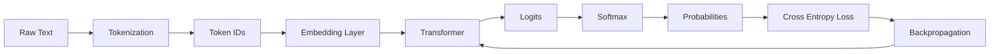

# LLM Pre-Training


### 1. LLM Pre-Training là gì?

Pre-training là giai đoạn đầu tiên để huấn luyện một LLM. Ở giai đoạn này, model chưa phải là chatbot như ChatGPT. Nó chỉ học một nhiệm vụ rất đơn giản:

`Dựa vào câu trước đó, hãy dự đoán token tiếp theo.`

Ví dụ: `The cat sat on the ___`. Model phải đoán tiếp là: `mat`

Nghe có vẻ đơn giản, nhưng khi làm việc này với hàng tỷ, hàng nghìn tỷ câu, model bắt đầu học được:
```
Ngữ pháp
Kiến thức thế giới
Logic
Cách viết code
Cách suy luận
```
### 2. Ý tưởng cốt lõi: Self-Supervised Learning

Trước đây, trong supervised learning, ta cần dữ liệu có nhãn. `ảnh con mèo → label: cat`, `ảnh con chó → label: dog`

Vấn đề là: phải có con người gán nhãn. Việc này rất tốn tiền, tốn thời gian.

Điểm đặc biệt của LLM là Không cần nhãn do con người tạo ra. Thay vào đó: `Văn bản = vừa input vừa label`

Ví dụ: `The cat sat on the mat`

Ta có thể tạo dữ liệu huấn luyện như sau:
| | Đầu vào (Những gì mô hình nhìn thấy) | Kết quả đầu ra (Mô hình cần dự đoán) |
| :--- | :--- | :--- |
| **Ví dụ 1** | `["The"]` | `cat` |
| **Ví dụ 2** | `["The", "cat"]` | `sat` |
| **Ví dụ 3** | `["The", "cat", "sat"]` | `on` |
| **Ví dụ 4** | `["The", "cat", "sat", "on"]` | `the` |
| **Ví dụ 5** | `["The", "cat", "sat", "on", "the"]` | `mat` |

-> 1 câu biến thành nhiều ví dụ huấn luyện.


### 3. Tokenization (Biến chữ thành số)

Mô hình không hiểu chữ, chỉ hiểu số. Tokenization là bước biến văn bản thành những mảnh nhỏ gọi là token.

**Bước 1: Tách text thành token**

Ví dụ:
```
"the cat jumped"
→ ["the", "cat", "jump", "##ed"]
```

**Bước 2: Đổi token thành ID**
```
["the", "cat", "jump", "##ed"]
→ [5, 8, 311, 94]
```

**Có 3 loại tokenization**

| Problem (Vấn đề) | Word-Level tokenization (Mã hóa cấp độ Từ) | Character-Level tokenization (Mã hóa cấp độ Ký tự) |
| :--- | :--- | :--- |
| **Massive Vocabulary**<br>(Từ vựng quá lớn) | Liệu "The" có khác "the"? "jump", "jumps", và "jumping" có phải là các từ riêng biệt không? Từ vừng sẽ cần phải lưu trữ mọi biến thể đơn lẻ, khiến kích thước của nó trở nên khổng lồ. | **Đã giải quyết.** Từ vựng cực kỳ nhỏ (A-Z, 0-9, dấu câu). |
| **Unknown Words**<br>(Từ lạ / Từ chưa biết) | Điều gì xảy ra với một từ mới như "hyper-threading" hoặc một từ gõ sai chính tả như "awesommmmme"? Mô hình không có dữ liệu cho nó. Đây là một điểm lỗi nghiêm trọng được gọi là vấn đề **Out-of-Vocabulary (OOV)**. | **Đã giải quyết.** Bất kỳ từ nào cũng có thể được xây dựng/ghép lại từ các ký tự. |
| **Sequence Length**<br>(Chiều dài chuỗi) | Chuỗi ngắn và dễ quản lý. Ví dụ: "The cat jumped." chỉ có 4 tokens. | **Kém hiệu quả nghiêm trọng.** Một câu gồm 4 từ sẽ biến thành hơn 20 tokens. Một đoạn văn có thể lên tới hàng nghìn tokens. Mô hình phải xử lý từng ký tự một, khiến việc học các quy luật ở khoảng cách xa trở nên chậm chạp và khó khăn. |

**Giải pháp: Subword Tokenization (GPT dùng cách này)**

LLM hiện đại thường dùng subword tokenization. Nó không cắt quá lớn như word-level, cũng không cắt quá nhỏ như character-level. Nó cắt thành các mảnh vừa phải, giống LEGO.

Ví dụ:
```
jumping → ["jump", "ing"]
quickly → ["quick", "ly"]
unbelievable → ["un", "believ", "able"]
```
Ý tưởng là: `Các từ phổ biến giữ nguyên. Các từ dài hoặc hiếm thì cắt thành mảnh nhỏ.`

Nhờ vậy: `vocabulary không quá lớn, sequence không quá dài, xử lý được từ mới`

Đây là lý do chúng ta ví token như LEGO — mỗi token là một mảnh ghép để xây nên từ hoặc câu.

Tuy nhiên, có một bí mật đen tối trong quá trình Tokenization. Tokenization giúp model hiệu quả, nhưng tạo ra một điểm yếu lạ.

Ví dụ từ: `strawberry`, nếu hỏi có bao nhiểu chữ `r`, ta có thể dễ dàng đếm có 3 chữ `r`. Nhưng model có thể nhìn nó như: `["str", "aw", "berry"]`. hoặc dưới dạng token ID: `[1234, 567, 890]`.

Vấn đề là chữ `r` bị giấu bên trong token:
```
"str" có 1 chữ r
"berry" có 2 chữ r
```
Model không tự nhiên nhìn thấy từng ký tự. Nó nhìn thấy các mảnh token đã được học. Vì vậy model có thể viết bài văn rất hay về quả dâu, nhưng lại có thể sai khi đếm số chữ r trong `"strawberry"`.

### 4. Token IDs

Sau tokenization, ta có: 
```
"The cat quickly jumped"
→ [5, 8, 73, 152, 311, 94]
```
Nhưng các số này chưa có ý nghĩa thật sự.

Ví dụ:
```
cat → 8
quick → 73
jump → 311
```
Không có nghĩa là `jump` lớn hơn `cat`, hay `quick` gần `cat`.

Các số này chỉ là mã định danh, giống như số áo cầu thủ. Ví dụ: `Messi mặc áo số 10`, `Ronaldo mặc áo số 7`. Không có nghĩa là Messi “lớn hơn” Ronaldo vì 10 > 7.

Vậy neural network không thể học trực tiếp từ ID thô. Nó cần biến ID thành vector.

Đó là nhiệm vụ tiếp theo của Embedding Layer.

### 5. Embedding Layer

Embedding layer biến mỗi token ID thành một vector.

Ví dụ:
```
cat → 8
8 → [0.2, -0.5, 1.1, 0.7]
mat → 91
91 → [0.1, -0.4, 1.0, 0.6]
```
Các vector này được học trong quá trình training. Ban đầu vector là ngẫu nhiên. Nhưng sau hàng tỷ lần học, model sẽ điều chỉnh để các token có liên quan nằm gần nhau hơn trong không gian vector.

Ví dụ sau khi học:
```
cat gần với dog
king gần với queen
Paris gần với France
Vietnam gần với Hanoi
```
Hiểu đơn giản: `Token ID là mã số. Embedding vector là “ý nghĩa toán học” của token.`

### 6. Transformer

Transformer được xem như một “black box”, tức là chưa đi sâu vào bên trong. Nhưng ta vẫn cần hiểu vai trò tổng quát.

Transformer nhận chuỗi embedding vectors:
```
"The" → vector
"cat" → vector
"sat" → vector
"on" → vector
"the" → vector
```

Sau đó nó xử lý ngữ cảnh để đoán token tiếp theo. Ví dụ: `The cat sat on the ___`

Transformer sẽ học rằng token tiếp theo có thể là:
```
mat
floor
rug
chair
```
Nhưng `"mat"` hợp lý nhất. Vai trò của Transformer là:
```
Đọc các token trước đó
Hiểu mối quan hệ giữa chúng
Tạo ra vector ngữ cảnh
Dự đoán token tiếp theo
```

### 7. Logits

Sau Transformer, model chưa đưa ra xác suất ngay. Nó tạo ra một danh sách điểm số gọi là logits. 

Giả sử vocabulary chỉ có vài token:
```
mat
rug
floor
moon
```
Sau câu: `The cat sat on the`

Model có thể tạo logits:
```
mat: 3.2
rug: 1.3
floor: 0.5
moon: -2.1
```
Logit là điểm số thô. Điểm càng cao nghĩa là model càng nghĩ token đó phù hợp.

Nhưng logits chưa phải xác suất vì: 
```
có thể âm
có thể dương
không cộng lại thành 1
```
-> Vì vậy cần dùng Softmax.

### 8. Softmax


