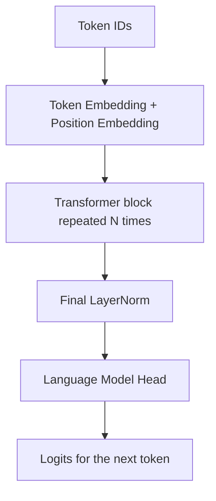
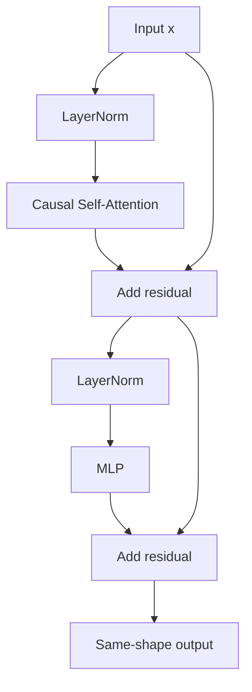

# Transformer kiểu GPT — Giải thích từ trực giác đến PyTorch

> Tài liệu này dành cho người mới học AI. Mục tiêu là hiểu một mô hình GPT nhỏ hoạt động ra sao.

## Transformer trong tài liệu này là loại nào?

Transformer là tên của một kiến trúc lớn. Tuy nhiên bài viết này tập trung vào **Decoder-only Transformer**, kiểu kiến trúc đứng sau GPT-2 và nhiều mô hình ngôn ngữ sinh văn bản.

Mô hình nhận một chuỗi token và học nhiệm vụ rất đơn giản:

`Dựa vào các token đã xuất hiện, hãy đoán token tiếp theo.`

Ví dụ:

```text
Đầu vào:  Hôm nay trời
Mục tiêu: đoán token tiếp theo, chẳng hạn "đẹp" hoặc "xấu"
```

Lặp nhiệm vụ này trên lượng văn bản rất lớn giúp mô hình học ngữ pháp, kiến thức, phong cách viết và nhiều quan hệ phức tạp trong ngôn ngữ.

---

## 1. Bản đồ toàn bộ mô hình



Mỗi khối Transformer gồm hai công việc:

1. **Attention — trao đổi thông tin:** mỗi token xem những token trước đó có gì liên quan.
2. **MLP — xử lý riêng:** mỗi token tự xử lý thông tin vừa thu thập được.

Hai đường nối tắt `residual` giúp thông tin cũ không bị mất khi đi qua nhiều lớp.



---

## 2. Đọc kích thước tensor trước khi đọc mã

Trong toàn bộ bài viết, ta dùng bốn ký hiệu:

| Ký hiệu | Tên | Ý nghĩa |
|---|---|---|
| `B` | Batch | Số chuỗi được xử lý cùng lúc |
| `T` | Time | Số token trong mỗi chuỗi |
| `C` | Channel/Embedding | Số chiều của vector biểu diễn một token |
| `V` | Vocabulary size | Tổng số token trong từ điển |

Ví dụ:

```text
B = 2: có 2 câu
T = 4: mỗi câu dài 4 token
C = 8: mỗi token được biểu diễn bằng 8 số
V = 1000: từ điển có 1000 token
```

Luồng kích thước chính:

| Giai đoạn | Kích thước |
|---|---|
| Token IDs | `(B, T)` |
| Sau embedding | `(B, T, C)` |
| Sau mọi khối Transformer | `(B, T, C)` |
| Logits | `(B, T, V)` |

Điểm quan trọng: các khối Transformer **không làm đổi** kích thước `(B, T, C)`. Nhờ vậy ta có thể xếp chồng nhiều khối.

---

## 3. Bản thiết kế: `GPTConfig`

```python
from dataclasses import dataclass

@dataclass
class GPTConfig:
    vocab_size: int
    block_size: int
    n_layer: int = 12
    n_head: int = 12
    n_embd: int = 768
    dropout: float = 0.1
```

| Tham số | Điều khiển điều gì? |
|---|---|
| `vocab_size` | Số token mà tokenizer có thể sử dụng |
| `block_size` | Số token tối đa mô hình được nhìn trong một lần |
| `n_layer` | Số khối Transformer xếp chồng — độ sâu |
| `n_head` | Số “góc nhìn” attention chạy song song |
| `n_embd` | Độ dài vector của mỗi token |
| `dropout` | Tỉ lệ đặc trưng bị tắt ngẫu nhiên khi huấn luyện |

Điều kiện bắt buộc:

```python
n_embd % n_head == 0
```

Vì vector `C` chiều phải được chia đều cho các attention head.

---

## 4. Token Embedding: đổi mã số thành vector có thể học

Tokenizer biến văn bản thành các số nguyên:

```text
"mèo ăn cá" → [31, 204, 87]
```

Nhưng số `204` không “lớn hơn về ý nghĩa” so với số `31`. Chúng chỉ là mã tra cứu. Mạng neural cần vector số thực để thực hiện phép nhân ma trận và học bằng gradient.

```python
token_embedding = nn.Embedding(vocab_size, n_embd)
tok_emb = token_embedding(idx)
```

Kích thước thay đổi như sau:

```text
idx:     (B, T)
tok_emb: (B, T, C)
```

Có thể hình dung `nn.Embedding` như một cuốn danh bạ tọa độ:

```text
token 0 → [ 0.12, -0.50,  0.31, ...]
token 1 → [-0.27,  0.18,  0.92, ...]
token 2 → [ 0.64,  0.07, -0.11, ...]
```

Ma trận embedding có kích thước `(V, C)`. Ban đầu các số gần như ngẫu nhiên; qua huấn luyện, chúng được điều chỉnh để hữu ích cho việc dự đoán token tiếp theo.

### Hạn chế của token embedding

Một token luôn nhận cùng một vector ban đầu, dù đứng trong ngữ cảnh nào. Từ “đường” trong “đường ăn” và “đường đi” vẫn bắt đầu bằng cùng một vector. Attention sẽ giải quyết vấn đề ngữ cảnh ở các bước sau.

---

## 5. Position Embedding: Cho mô hình biết thứ tự

Nếu chỉ có token embedding, mô hình biết các token xuất hiện nhưng chưa có tín hiệu rõ ràng về vị trí. Trong ngôn ngữ, thứ tự rất quan trọng:

```text
"chó cắn người" ≠ "người cắn chó"
```

GPT-2 học thêm một vector cho mỗi vị trí:

```python
position_embedding = nn.Embedding(block_size, n_embd)

B, T = idx.shape
pos = torch.arange(T, device=idx.device)
pos_emb = position_embedding(pos)
x = tok_emb + pos_emb
```

Kích thước:

```text
tok_emb: (B, T, C)
pos_emb:    (T, C)
x:       (B, T, C)
```

PyTorch dùng **broadcasting** để cộng cùng một bảng vị trí `(T, C)` vào mọi câu trong batch.

Vector cuối cùng mang hai loại thông tin:

```text
x = thông tin về token + thông tin về vị trí
```

---

## 6. Self-Attention: Mỗi token nên nghe ai?

Hãy tưởng tượng một lớp học. Mỗi học sinh có:

- một câu hỏi đang cần tìm lời giải;
- một tấm thẻ mô tả kiến thức mình có;
- phần thông tin sẵn sàng chia sẻ.

Đó chính là ba vector trong attention:

| Vector | Câu hỏi trực giác | Vai trò |
|---|---|---|
| Query `Q` | “Tôi đang cần loại thông tin nào?” | Dùng để tìm kiếm |
| Key `K` | “Tôi có loại thông tin nào?” | Dùng để so khớp |
| Value `V` | “Đây là nội dung tôi sẽ chia sẻ” | Thông tin được tổng hợp |

`Q`, `K`, `V` không được viết thủ công. Mô hình tự học ba phép biến đổi tuyến tính:

```python
q = x @ W_q
k = x @ W_k
v = x @ W_v
```

### Công thức attention

$$
\mathop{\mathrm{Attention}}(Q,K,V) 
= \mathop{\mathrm{softmax}}\left(\frac{QK^T}{\sqrt{d_k}} + M\right)V
$$

Trong đó:

- `QKᵀ`: tính mức liên quan giữa mọi cặp token;
- `√d_k`: giữ điểm số không phình quá lớn;
- `M`: causal mask chặn thông tin từ tương lai;
- `softmax`: biến điểm số thành tỉ lệ có tổng bằng `1`;
- nhân với `V`: trộn thông tin theo các tỉ lệ vừa tìm được.

### Theo dõi kích thước của một attention head

Giả sử `x` có kích thước `(B, T, C)`:

| Phép tính | Kích thước đầu vào | Kết quả |
|---|---|---|
| Tạo `q, k, v` | `(B, T, C)` | mỗi tensor `(B, T, C)` |
| `k.transpose(-2, -1)` | `(B, T, C)` | `(B, C, T)` |
| `q @ kᵀ` | `(B, T, C) @ (B, C, T)` | `(B, T, T)` |
| `softmax(scores)` | `(B, T, T)` | `(B, T, T)` |
| `weights @ v` | `(B, T, T) @ (B, T, C)` | `(B, T, C)` |

Ma trận `(T, T)` trả lời: **mỗi token dành bao nhiêu sự chú ý cho từng token khác?**

### Ví dụ nhỏ

Với câu “con mèo ăn cá”, hàng attention của token “ăn” có thể trông như sau:

| Token được nhìn | con | mèo | ăn | cá |
|---|---:|---:|---:|---:|
| Trọng số của “ăn” | 0.10 | 0.55 | 0.35 | 0.00 |

Số `0.00` ở “cá” xuất hiện vì khi xử lý vị trí “ăn”, GPT chưa được phép nhìn token tương lai.

---

## 7. Causal Mask: Không cho mô hình nhìn đáp án

GPT sinh văn bản từ trái sang phải. Khi dự đoán token thứ ba, mô hình chỉ được dùng token thứ nhất, thứ hai và chính vị trí hiện tại; nó không được đọc token thứ tư.

Mask tam giác dưới cho chuỗi dài 4:

```text
1 0 0 0
1 1 0 0
1 1 1 0
1 1 1 1
```

Ta thay điểm attention ở nơi mask bằng `0` thành `-∞`:

```python
scores = scores.masked_fill(mask == 0, float("-inf"))
weights = F.softmax(scores, dim=-1)
```

Vì `exp(-∞) = 0`, trọng số của mọi vị trí tương lai trở thành `0` sau softmax.

Mask được đăng ký bằng `register_buffer`:

```python
self.register_buffer(
    "causal_mask",
    torch.tril(torch.ones(block_size, block_size))
         .view(1, 1, block_size, block_size)
)
```

Buffer đi cùng mô hình khi chuyển sang GPU, nhưng không phải tham số cần học.

---

## 8. Multi-Head Attention: Nhiều góc nhìn song song

Một attention head có thể học một kiểu quan hệ. Nhiều head cho phép mô hình phân tích nhiều quan hệ cùng lúc, chẳng hạn:

- chủ ngữ liên hệ với động từ;
- đại từ đang nhắc tới danh từ nào;
- từ hiện tại liên hệ với một ý xuất hiện từ xa;
- dấu câu báo hiệu cấu trúc câu ra sao.

Không nên hiểu rằng ta gán sẵn nhiệm vụ cho từng head. Các vai trò này tự xuất hiện trong quá trình học và không phải head nào cũng dễ diễn giải.

### Chia vector thành nhiều head

Với `C = 768` và `n_head = 12`:

```text
head_dim = 768 / 12 = 64
```

Phép biến đổi kích thước:

```text
(B, T, C)
→ view(B, T, n_head, head_dim)
→ transpose(1, 2)
→ (B, n_head, T, head_dim)
```

Mỗi head chạy attention độc lập. Sau đó ta ghép chúng lại:

```text
(B, n_head, T, head_dim)
→ transpose(1, 2)
→ (B, T, n_head, head_dim)
→ view(B, T, C)
```

`.contiguous()` thường được gọi trước `.view()` vì `transpose()` thay đổi cách tensor nhìn dữ liệu trong bộ nhớ.

### Mã Multi-Head Causal Self-Attention

```python
class CausalSelfAttention(nn.Module):
    def __init__(self, config):
        super().__init__()
        assert config.n_embd % config.n_head == 0

        self.n_head = config.n_head
        self.n_embd = config.n_embd

        # Tạo Q, K, V trong một phép chiếu để GPU xử lý hiệu quả hơn.
        self.c_attn = nn.Linear(config.n_embd, 3 * config.n_embd)
        self.c_proj = nn.Linear(config.n_embd, config.n_embd)
        self.attn_drop = nn.Dropout(config.dropout)
        self.resid_drop = nn.Dropout(config.dropout)

        self.register_buffer(
            "causal_mask",
            torch.tril(torch.ones(config.block_size, config.block_size))
                 .view(1, 1, config.block_size, config.block_size)
        )

    def forward(self, x):
        B, T, C = x.shape
        head_dim = C // self.n_head

        qkv = self.c_attn(x)                 # (B, T, 3C)
        q, k, v = qkv.split(C, dim=-1)       # mỗi tensor: (B, T, C)

        q = q.view(B, T, self.n_head, head_dim).transpose(1, 2)
        k = k.view(B, T, self.n_head, head_dim).transpose(1, 2)
        v = v.view(B, T, self.n_head, head_dim).transpose(1, 2)
        # q, k, v: (B, n_head, T, head_dim)

        scores = (q @ k.transpose(-2, -1)) / math.sqrt(head_dim)
        # scores: (B, n_head, T, T)

        mask = self.causal_mask[:, :, :T, :T]
        scores = scores.masked_fill(mask == 0, float("-inf"))

        weights = F.softmax(scores, dim=-1)
        weights = self.attn_drop(weights)
        y = weights @ v                    # (B, n_head, T, head_dim)

        y = y.transpose(1, 2).contiguous().view(B, T, C)
        y = self.resid_drop(self.c_proj(y))
        return y
```

---

## 9. MLP: Sau khi “nghe”, mỗi token tự “suy nghĩ”

Attention trộn thông tin giữa các token. MLP xử lý từng token độc lập bằng cùng một mạng neural:

```python
class MLP(nn.Module):
    def __init__(self, config):
        super().__init__()
        self.fc = nn.Linear(config.n_embd, 4 * config.n_embd)
        self.proj = nn.Linear(4 * config.n_embd, config.n_embd)
        self.drop = nn.Dropout(config.dropout)

    def forward(self, x):
        x = self.fc(x)       # (B, T, C) → (B, T, 4C)
        x = F.gelu(x)        # thêm tính phi tuyến
        x = self.proj(x)     # (B, T, 4C) → (B, T, C)
        return self.drop(x)
```

Tại sao phải mở rộng từ `C` lên `4C` rồi thu lại?

Có thể hình dung `C` chiều là một bàn làm việc nhỏ. Mở rộng lên `4C` tạo thêm “không gian tính toán” để mô hình kết hợp đặc trưng theo nhiều cách, GELU giữ lại các quan hệ phi tuyến hữu ích, sau đó lớp `proj` nén kết quả về kích thước ban đầu.

MLP không làm các token nói chuyện với nhau. Nếu đầu vào có `T` token, cùng một MLP được áp dụng riêng cho cả `T` vị trí.

---

## 10. Residual Connection và LayerNorm

### Residual: Học phần cần sửa thay vì viết lại mọi thứ

```python
x = x + sublayer(x)
```

Sublayer chỉ cần học một lượng điều chỉnh cho `x`. Đường cộng trực tiếp cũng tạo lối đi thuận lợi cho gradient khi lan truyền ngược, giúp huấn luyện mạng sâu ổn định hơn.

Ví dụ:

```text
x cũ:          [0.2,  0.1, 0.3]
attention sửa: [0.1, -0.1, 0.2]
x mới:         [0.3,  0.0, 0.5]
```

Hai vế phải cùng kích thước `(B, T, C)`, vì phép cộng diễn ra theo từng phần tử.

### LayerNorm: Giữ thang giá trị ổn định

Với từng token, LayerNorm chuẩn hóa các giá trị dọc theo chiều `C`:

$$
\hat{x}=\frac{x-\mu}{\sqrt{\sigma^2+\epsilon}},
\qquad y=\gamma\hat{x}+\beta
$$

- `μ`: trung bình các phần tử trong vector token;
- `σ²`: phương sai;
- `ε`: số rất nhỏ để tránh chia cho `0`;
- `γ`, `β`: hai tham số học được để mô hình tự chọn độ co giãn và độ dịch phù hợp.

GPT-2 dùng **Pre-Norm**:

```python
x = x + self.attn(self.ln_1(x))
x = x + self.mlp(self.ln_2(x))
```

Tức là chuẩn hóa trước khi đưa dữ liệu vào attention hoặc MLP.

### Một khối Transformer hoàn chỉnh

```python
class Block(nn.Module):
    def __init__(self, config):
        super().__init__()
        self.ln_1 = nn.LayerNorm(config.n_embd)
        self.attn = CausalSelfAttention(config)
        self.ln_2 = nn.LayerNorm(config.n_embd)
        self.mlp = MLP(config)

    def forward(self, x):
        x = x + self.attn(self.ln_1(x))
        x = x + self.mlp(self.ln_2(x))
        return x
```

Đầu vào và đầu ra đều có kích thước `(B, T, C)`, nên có thể tạo mô hình sâu bằng:

```python
self.blocks = nn.ModuleList(
    [Block(config) for _ in range(config.n_layer)]
)
```

Mỗi block là một đối tượng riêng với bộ trọng số riêng; các block không mặc định dùng chung trọng số.

---

## 11. Language Model Head: Đổi vector thành dự đoán

Sau các block, ta có một vector `C` chiều cho mỗi vị trí. Để dự đoán token, mô hình phải tạo một điểm số cho **mọi token trong từ điển**:

```python
self.lm_head = nn.Linear(n_embd, vocab_size, bias=False)
logits = self.lm_head(x)
```

Kích thước:

```text
x:      (B, T, C)
logits: (B, T, V)
```

`logits[b, t, v]` là điểm thô cho khả năng token `v` xuất hiện sau ngữ cảnh kết thúc ở vị trí `t`.

### Tại sao tạo `T` dự đoán?

Với chuỗi:

```text
Input:  [Hôm, nay, trời, đẹp]
Target: [nay, trời, đẹp, quá]
```

Mô hình học bốn bài toán trong một lượt chạy:

```text
Hôm            → nay
Hôm nay        → trời
Hôm nay trời   → đẹp
Hôm nay trời đẹp → quá
```

Causal mask bảo đảm dự đoán tại vị trí `t` không dùng đáp án ở tương lai.

### Weight tying

Ma trận token embedding và trọng số của `lm_head` có cùng kích thước `(V, C)`, nên GPT thường cho chúng dùng chung dữ liệu:

```python
self.lm_head.weight = self.token_embedding.weight
```

Ý tưởng trực giác:

- embedding: từ ID đi tới vector ý nghĩa;
- language head: so vector hiện tại với vector của mọi ID để chọn token phù hợp.

Việc dùng chung giúp giảm rất nhiều tham số và thường cải thiện khả năng học.

---

## 12. Huấn luyện: Từ dự đoán sai đến cập nhật trọng số

### Chuẩn bị cặp input–target

Giả sử luồng token là:

```text
[5, 12, 8, 21, 6]
```

Ta tạo:

```text
idx     = [5, 12, 8, 21]
targets = [12, 8, 21, 6]
```

Target chính là chuỗi được dịch sang trái một token.

### Cross-entropy loss

PyTorch cần gom hai chiều `B` và `T` thành một chiều:

```python
loss = F.cross_entropy(
    logits.reshape(-1, logits.size(-1)),  # (B*T, V)
    targets.reshape(-1)                   # (B*T)
)
```

Loss đo xem mô hình đã dành xác suất cao đến đâu cho token đúng ở từng vị trí, rồi mặc định lấy trung bình trên `B*T` vị trí. Loss càng thấp thì dự đoán càng gần mục tiêu.

### Một bước huấn luyện

```python
optimizer.zero_grad()
logits, loss = model(idx, targets)
loss.backward()
optimizer.step()
```

| Bước | Việc xảy ra |
|---|---|
| `zero_grad()` | Xóa gradient còn lại từ bước trước |
| Forward | Tạo logits và tính loss |
| `backward()` | Tính gradient của mọi tham số |
| `step()` | Dùng gradient để cập nhật trọng số |

Quá trình này lặp lại trên rất nhiều batch.

---

## 13. Sinh văn bản tự hồi quy

Sau huấn luyện, mô hình sinh từng token:

```text
Prompt → đoán token mới → nối vào prompt → đoán tiếp → ...
```

Ví dụ:

```text
"Hôm nay" → "trời"
"Hôm nay trời" → "đẹp"
"Hôm nay trời đẹp" → "quá"
```

Mỗi vòng chỉ dùng logits ở vị trí cuối:

```python
logits = logits[:, -1, :]
```

### Temperature và top-k

| Tham số | Tác dụng |
|---|---|
| `temperature < 1` | Tập trung hơn vào token có xác suất cao; ít ngẫu nhiên |
| `temperature > 1` | Phân phối phẳng hơn; sáng tạo hơn nhưng dễ sai hơn |
| `top_k = k` | Chỉ cho phép lấy mẫu trong `k` token có điểm cao nhất |

`temperature` không làm mô hình thông minh hơn; nó chỉ thay đổi cách lấy mẫu từ dự đoán đã có.

Khi chuỗi vượt `block_size`, mã đơn giản chỉ giữ phần ngữ cảnh gần nhất:

```python
idx_cond = idx[:, -self.config.block_size:]
```

---

## 14. Mã GPT tối giản hoàn chỉnh

Đoạn mã dưới đây ghép tất cả thành phần đã học. Đây là kiến trúc để nghiên cứu; muốn tạo văn bản có nghĩa, bạn vẫn cần tokenizer, dữ liệu và quá trình huấn luyện.

```python
import math
from dataclasses import dataclass

import torch
import torch.nn as nn
import torch.nn.functional as F


@dataclass
class GPTConfig:
    vocab_size: int
    block_size: int
    n_layer: int = 6
    n_head: int = 6
    n_embd: int = 384
    dropout: float = 0.1


class CausalSelfAttention(nn.Module):
    def __init__(self, config):
        super().__init__()
        assert config.n_embd % config.n_head == 0

        self.n_head = config.n_head
        self.n_embd = config.n_embd
        self.c_attn = nn.Linear(config.n_embd, 3 * config.n_embd)
        self.c_proj = nn.Linear(config.n_embd, config.n_embd)
        self.attn_drop = nn.Dropout(config.dropout)
        self.resid_drop = nn.Dropout(config.dropout)

        self.register_buffer(
            "causal_mask",
            torch.tril(torch.ones(config.block_size, config.block_size))
                 .view(1, 1, config.block_size, config.block_size)
        )

    def forward(self, x):
        B, T, C = x.shape
        head_dim = C // self.n_head

        qkv = self.c_attn(x)
        q, k, v = qkv.split(C, dim=-1)

        q = q.view(B, T, self.n_head, head_dim).transpose(1, 2)
        k = k.view(B, T, self.n_head, head_dim).transpose(1, 2)
        v = v.view(B, T, self.n_head, head_dim).transpose(1, 2)

        scores = (q @ k.transpose(-2, -1)) / math.sqrt(head_dim)
        mask = self.causal_mask[:, :, :T, :T]
        scores = scores.masked_fill(mask == 0, float("-inf"))

        weights = F.softmax(scores, dim=-1)
        weights = self.attn_drop(weights)
        y = weights @ v

        y = y.transpose(1, 2).contiguous().view(B, T, C)
        return self.resid_drop(self.c_proj(y))


class MLP(nn.Module):
    def __init__(self, config):
        super().__init__()
        self.fc = nn.Linear(config.n_embd, 4 * config.n_embd)
        self.proj = nn.Linear(4 * config.n_embd, config.n_embd)
        self.drop = nn.Dropout(config.dropout)

    def forward(self, x):
        x = self.fc(x)
        x = F.gelu(x)
        x = self.proj(x)
        return self.drop(x)


class Block(nn.Module):
    def __init__(self, config):
        super().__init__()
        self.ln_1 = nn.LayerNorm(config.n_embd)
        self.attn = CausalSelfAttention(config)
        self.ln_2 = nn.LayerNorm(config.n_embd)
        self.mlp = MLP(config)

    def forward(self, x):
        x = x + self.attn(self.ln_1(x))
        x = x + self.mlp(self.ln_2(x))
        return x


class GPT(nn.Module):
    def __init__(self, config):
        super().__init__()
        self.config = config

        self.token_embedding = nn.Embedding(
            config.vocab_size, config.n_embd
        )
        self.position_embedding = nn.Embedding(
            config.block_size, config.n_embd
        )
        self.drop = nn.Dropout(config.dropout)
        self.blocks = nn.ModuleList(
            [Block(config) for _ in range(config.n_layer)]
        )
        self.ln_f = nn.LayerNorm(config.n_embd)
        self.lm_head = nn.Linear(
            config.n_embd, config.vocab_size, bias=False
        )

        # Token embedding và đầu ra dùng chung một ma trận.
        self.lm_head.weight = self.token_embedding.weight

    def forward(self, idx, targets=None):
        B, T = idx.shape
        if T > self.config.block_size:
            raise ValueError("Chuỗi dài hơn block_size")

        pos = torch.arange(T, device=idx.device)
        tok_emb = self.token_embedding(idx)       # (B, T, C)
        pos_emb = self.position_embedding(pos)    # (T, C)
        x = self.drop(tok_emb + pos_emb)           # (B, T, C)

        for block in self.blocks:
            x = block(x)

        x = self.ln_f(x)
        logits = self.lm_head(x)                  # (B, T, V)

        loss = None
        if targets is not None:
            loss = F.cross_entropy(
                logits.reshape(-1, logits.size(-1)),
                targets.reshape(-1)
            )

        return logits, loss

    @torch.no_grad()
    def generate(
        self,
        idx,
        max_new_tokens=50,
        temperature=1.0,
        top_k=None
    ):
        self.eval()

        for _ in range(max_new_tokens):
            idx_cond = idx[:, -self.config.block_size:]
            logits, _ = self(idx_cond)
            logits = logits[:, -1, :]
            logits = logits / max(temperature, 1e-8)

            if top_k is not None:
                k = min(top_k, logits.size(-1))
                top_values, _ = torch.topk(logits, k)
                threshold = top_values[:, -1].unsqueeze(-1)
                logits = logits.masked_fill(
                    logits < threshold, float("-inf")
                )

            probs = F.softmax(logits, dim=-1)
            next_token = torch.multinomial(probs, num_samples=1)
            idx = torch.cat([idx, next_token], dim=1)

        return idx
```

### Kiểm tra nhanh kích thước

```python
config = GPTConfig(
    vocab_size=1000,
    block_size=32,
    n_layer=4,
    n_head=4,
    n_embd=128
)

model = GPT(config)

B, T = 2, 8
idx = torch.randint(0, config.vocab_size, (B, T))
targets = torch.randint(0, config.vocab_size, (B, T))

logits, loss = model(idx, targets)

print(logits.shape)  # torch.Size([2, 8, 1000])
print(loss.shape)    # torch.Size([]) — một số vô hướng
```

---
