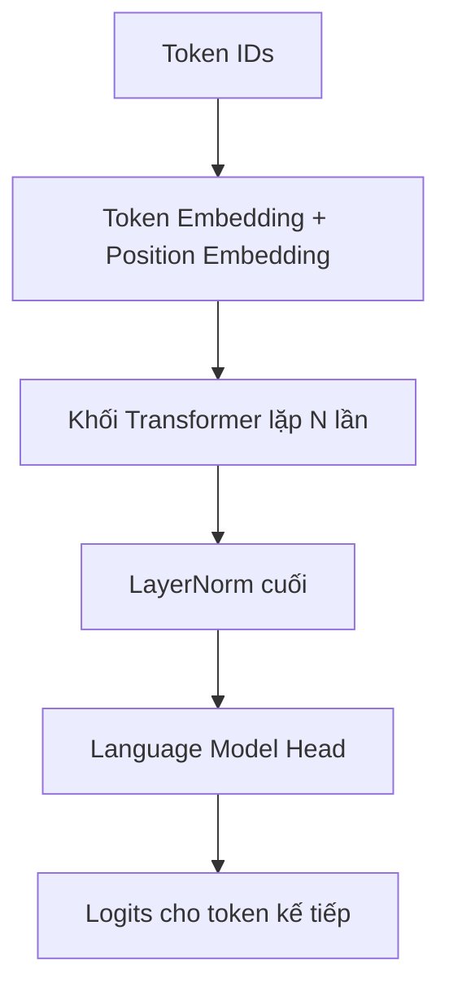
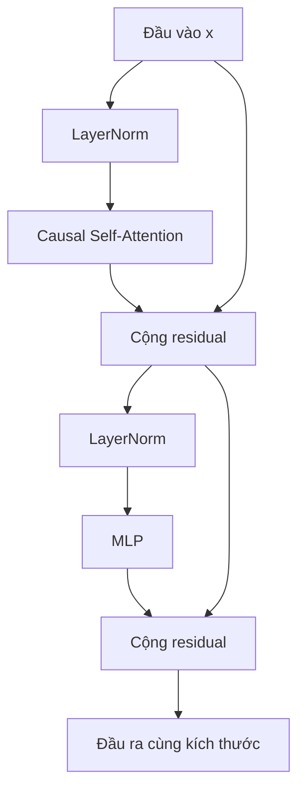

# Transformer kiểu GPT — Giải thích từ trực giác đến PyTorch

> Tài liệu này dành cho người mới học AI. Mục tiêu là hiểu một mô hình GPT nhỏ hoạt động ra sao.

## Transformer trong tài liệu này là loại nào?

“Transformer” là tên của một kiến trúc lớn. Tuy nhiên bài viết này tập trung vào **Decoder-only Transformer** — kiểu kiến trúc đứng sau GPT-2 và nhiều mô hình ngôn ngữ sinh văn bản.

Mô hình nhận một chuỗi token và học nhiệm vụ rất đơn giản:

> Dựa vào các token đã xuất hiện, hãy đoán token tiếp theo.

Ví dụ:

```text
Đầu vào:  Hôm nay trời
Mục tiêu: đoán token tiếp theo, chẳng hạn "đẹp"
```

Lặp nhiệm vụ này trên lượng văn bản rất lớn giúp mô hình học ngữ pháp, kiến thức, phong cách viết và nhiều quan hệ phức tạp trong ngôn ngữ.

---

## 1. Bản đồ toàn bộ mô hình



Mỗi khối Transformer gồm hai công việc:

1. **Attention — trao đổi thông tin:** mỗi token xem những token trước đó có gì liên quan.
2. **MLP — xử lý riêng:** mỗi token tự xử lý thông tin vừa thu thập được.

Hai đường nối tắt `residual` giúp thông tin cũ không bị mất khi đi qua nhiều lớp.



---

## 2. Đọc kích thước tensor trước khi đọc mã

Trong toàn bộ bài viết, ta dùng bốn ký hiệu:

| Ký hiệu | Tên | Ý nghĩa |
|---|---|---|
| `B` | Batch | Số chuỗi được xử lý cùng lúc |
| `T` | Time | Số token trong mỗi chuỗi |
| `C` | Channel/Embedding | Số chiều của vector biểu diễn một token |
| `V` | Vocabulary size | Tổng số token trong từ điển |

Ví dụ:

```text
B = 2: có 2 câu
T = 4: mỗi câu dài 4 token
C = 8: mỗi token được biểu diễn bằng 8 số
V = 1000: từ điển có 1000 token
```

Luồng kích thước chính:

| Giai đoạn | Kích thước |
|---|---|
| Token IDs | `(B, T)` |
| Sau embedding | `(B, T, C)` |
| Sau mọi khối Transformer | `(B, T, C)` |
| Logits | `(B, T, V)` |

Điểm quan trọng: các khối Transformer **không làm đổi** kích thước `(B, T, C)`. Nhờ vậy ta có thể xếp chồng nhiều khối.

---

## 3. Bản thiết kế: `GPTConfig`

```python
from dataclasses import dataclass

@dataclass
class GPTConfig:
    vocab_size: int
    block_size: int
    n_layer: int = 12
    n_head: int = 12
    n_embd: int = 768
    dropout: float = 0.1
```

| Tham số | Điều khiển điều gì? |
|---|---|
| `vocab_size` | Số token mà tokenizer có thể sử dụng |
| `block_size` | Số token tối đa mô hình được nhìn trong một lần |
| `n_layer` | Số khối Transformer xếp chồng — độ sâu |
| `n_head` | Số “góc nhìn” attention chạy song song |
| `n_embd` | Độ dài vector của mỗi token |
| `dropout` | Tỉ lệ đặc trưng bị tắt ngẫu nhiên khi huấn luyện |

Điều kiện bắt buộc:

```python
n_embd % n_head == 0
```

Vì vector `C` chiều phải được chia đều cho các attention head.

---

## 4. Token Embedding: đổi mã số thành vector có thể học

Tokenizer biến văn bản thành các số nguyên:

```text
"mèo ăn cá" → [31, 204, 87]
```

Nhưng số `204` không “lớn hơn về ý nghĩa” so với số `31`. Chúng chỉ là mã tra cứu. Mạng neural cần vector số thực để thực hiện phép nhân ma trận và học bằng gradient.

```python
token_embedding = nn.Embedding(vocab_size, n_embd)
tok_emb = token_embedding(idx)
```

Kích thước thay đổi như sau:

```text
idx:     (B, T)
tok_emb: (B, T, C)
```

Có thể hình dung `nn.Embedding` như một cuốn danh bạ tọa độ:

```text
token 0 → [ 0.12, -0.50,  0.31, ...]
token 1 → [-0.27,  0.18,  0.92, ...]
token 2 → [ 0.64,  0.07, -0.11, ...]
```

Ma trận embedding có kích thước `(V, C)`. Ban đầu các số gần như ngẫu nhiên; qua huấn luyện, chúng được điều chỉnh để hữu ích cho việc dự đoán token tiếp theo.

### Hạn chế của token embedding

Một token luôn nhận cùng một vector ban đầu, dù đứng trong ngữ cảnh nào. Từ “đường” trong “đường ăn” và “đường đi” vẫn bắt đầu bằng cùng một vector. Attention sẽ giải quyết vấn đề ngữ cảnh ở các bước sau.

---
