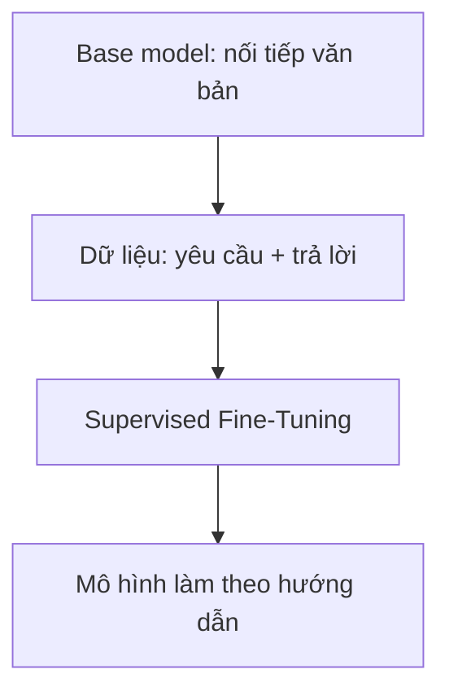
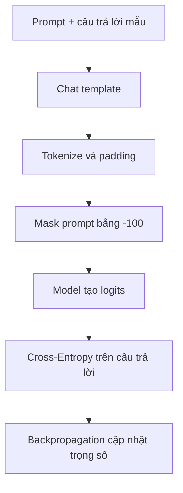

# Supervised Fine-Tuning (SFT): Dạy LLM biết làm theo hướng dẫn

## Mục lục

- [1. SFT giải quyết vấn đề gì?](#1-sft-giải-quyết-vấn-đề-gì)
- [2. SFT hoạt động như thế nào?](#2-sft-hoạt-động-như-thế-nào)
- [3. Cross-Entropy Loss là gì?](#3-cross-entropy-loss-là-gì)
- [4. Bí quyết quan trọng: Loss Masking](#4-bí-quyết-quan-trọng-loss-masking)
- [5. Nhìn SFT qua tensor](#5-nhìn-sft-qua-tensor)
- [6. Cài đặt bằng PyTorch](#6-cài-đặt-bằng-pytorch)
- [7. Một bước huấn luyện](#7-một-bước-huấn-luyện)
- [8. SFT làm được và chưa làm được gì?](#8-sft-làm-được-và-chưa-làm-được-gì)
- [9. Tóm tắt](#9-tóm-tắt)

---

## 1. SFT giải quyết vấn đề gì?

Một base model vừa hoàn thành pre-training chưa thật sự là trợ lý. Nó giống một học sinh đã đọc rất nhiều sách nhưng chưa được dạy cách trả lời người dùng.

Nhiệm vụ gốc của nó chỉ là:

> Nhìn các token phía trước và đoán token tiếp theo.

Ví dụ, khi nhận được:

```text
Thủ đô của Việt Nam là gì?
```

base model có thể nối tiếp thành:

```text
A. Hà Nội
B. Đà Nẵng
C. Thành phố Hồ Chí Minh
```

Nó không cố tình né câu hỏi. Trong dữ liệu Internet, câu hỏi kiểu này thường xuất hiện trong đề trắc nghiệm, nên việc tạo thêm các đáp án là một cách nối văn bản hợp lý.

**Supervised Fine-Tuning (SFT)** giúp thay đổi hành vi đó. Ta đưa cho mô hình nhiều ví dụ gồm:

```text
(yêu cầu của người dùng, câu trả lời mẫu)
```

Ví dụ:

```text
Yêu cầu: Giải thích lực hấp dẫn cho học sinh lớp 6.
Trả lời: Lực hấp dẫn là lực kéo mọi vật về phía Trái Đất...
```

Mô hình học cách bắt chước những câu trả lời tốt. Có thể hình dung:

- **Pre-training:** đọc cả thư viện để học ngôn ngữ và kiến thức.
- **SFT:** học với một bộ bài mẫu để biết cách trả lời đúng vai trò.



---

## 2. SFT hoạt động như thế nào?

LLM không nhận riêng một ô “câu hỏi” và một ô “câu trả lời”. Nó nhận một chuỗi token liên tục. Vì vậy, ta ghép hai phần bằng **chat template**:

```text
<|user|> Thủ đô của Việt Nam là gì? <|end|>
<|assistant|> Thủ đô của Việt Nam là Hà Nội. <|end|>
```

Các token đặc biệt có vai trò như biển báo:

| Token | Ý nghĩa |
|---|---|
| `<|user|>` | Người dùng bắt đầu nói |
| `<|assistant|>` | Đến lượt trợ lý trả lời |
| `<|end|>` | Kết thúc một lượt nói |

Quy trình tổng quát:

1. Chuẩn bị nhiều cặp `prompt` và `response` chất lượng cao.
2. Ghép chúng theo chat template của mô hình.
3. Tokenizer đổi văn bản thành các số nguyên gọi là `input_ids`.
4. Mô hình dự đoán token tiếp theo ở từng vị trí.
5. Chỉ tính lỗi trên phần trả lời của trợ lý.
6. Backpropagation cập nhật trọng số để lần sau mô hình trả lời gần mẫu hơn.

Điểm số 5 là phần quan trọng nhất của SFT.

---

## 3. Cross-Entropy Loss là gì?

Mỗi lần đoán token tiếp theo, mô hình tạo một điểm số cho mọi token trong từ điển. `softmax` biến các điểm số này thành xác suất.

Giả sử đáp án đúng là token `Hà_Nội`:

| Mô hình dự đoán | Xác suất của `Hà_Nội` | Kết quả |
|---|---:|---|
| Rất tự tin và đúng | 0.90 | Loss nhỏ |
| Không chắc chắn | 0.40 | Loss vừa |
| Gần như chọn sai | 0.01 | Loss rất lớn |

Loss của token đúng được tính bằng:

$$
L = -\log(p)
$$

Trong đó $p$ là xác suất mô hình dành cho token đúng.

Ví dụ:

| $p$ | $-\log(p)$ | Diễn giải |
|---:|---:|---|
| 0.90 | 0.105 | Đoán tốt |
| 0.50 | 0.693 | Chưa chắc |
| 0.01 | 4.605 | Đoán rất tệ |

Hãy xem loss như **điểm phạt vì bất ngờ**: mô hình càng bất ngờ trước đáp án đúng thì bị phạt càng nhiều.

Với cả câu trả lời, ta lấy trung bình loss của các token cần học:

$$
\mathcal{L}_{\text{SFT}}
= -\frac{1}{|y|}\sum_{t=1}^{|y|}
\log P_\theta(y_t\mid x,y_{<t})
$$

Đọc công thức bằng lời:

- $x$: yêu cầu của người dùng;
- $y_t$: token đúng thứ $t$ trong câu trả lời;
- $y_{<t}$: những token trả lời đứng trước nó;
- $P_\theta$: xác suất do mô hình hiện tại dự đoán;
- tổng chỉ chạy trên **các token thuộc câu trả lời**.

---

## 4. Bí quyết quan trọng: Loss Masking

Nếu tính loss trên toàn bộ cuộc hội thoại, mô hình còn bị yêu cầu học cách tạo ra câu hỏi của người dùng. Đó không phải mục tiêu chính của trợ lý.

Ta giải quyết bằng hai tensor:

- `input_ids`: chứa toàn bộ cuộc hội thoại để mô hình có đủ ngữ cảnh.
- `labels`: cho biết những token nào được dùng để chấm điểm.

Ở các vị trí không muốn chấm, ta đặt label bằng `-100`. Theo mặc định, `CrossEntropyLoss` của PyTorch bỏ qua nhãn này.

Ví dụ đã đơn giản hóa:

| Token | `input_ids` | `labels` | Tính loss? |
|---|---:|---:|:---:|
| `<|user|>` | 10 | -100 | Không |
| `2` | 21 | -100 | Không |
| `+` | 22 | -100 | Không |
| `3` | 23 | -100 | Không |
| `<|assistant|>` | 11 | -100 | Không |
| `5` | 25 | 25 | Có |
| `<|end|>` | 12 | 12 | Có |

Điều đáng nhớ:

> `-100` không xóa prompt khỏi đầu vào. Mô hình vẫn đọc prompt, nhưng không bị chấm điểm vì đã dự đoán các token thuộc prompt.

Token `<|end|>` trong phần trả lời vẫn được chấm để mô hình học lúc nào cần dừng.

---

## 5. Nhìn SFT qua tensor

Giả sử một batch có:

- `B = 2`: hai cuộc hội thoại;
- `T = 8`: mỗi chuỗi dài tám token sau khi padding;
- `V = 1000`: từ điển có 1.000 token.

Các shape chính là:

| Tensor | Shape | Chứa gì? |
|---|---|---|
| `input_ids` | `(B, T)` = `(2, 8)` | ID token đưa vào mô hình |
| `attention_mask` | `(B, T)` = `(2, 8)` | Phân biệt token thật và padding |
| `logits` | `(B, T, V)` = `(2, 8, 1000)` | Điểm dự đoán cho mọi token |
| `labels` | `(B, T)` = `(2, 8)` | Token đúng hoặc `-100` |

Để tính Cross-Entropy, hai chiều `B` và `T` thường được gộp:

```text
logits: (B, T, V) → (B × T, V)
labels: (B, T)    → (B × T)
```

Với ví dụ trên:

```text
(2, 8, 1000) → (16, 1000)
(2, 8)       → (16)
```

Mỗi trong 16 vị trí trở thành một bài toán phân loại: “Trong 1.000 token, token đúng là token nào?”. Các vị trí có label `-100` sẽ bị bỏ qua.

> Các lớp `AutoModelForCausalLM` phổ biến thường tự dịch `logits` và `labels` một bước bên trong để dự đoán token kế tiếp. Vì vậy, khi truyền `labels=input_ids`, bạn không nên tự dịch lần nữa nếu tài liệu của model không yêu cầu.

---

## 6. Cài đặt bằng PyTorch

Hàm dưới đây thể hiện phần cốt lõi cho **một cặp** `prompt`–`response`:

```python
import torch


def prepare_sft_example(prompt: str, response: str, tokenizer):
    """Biến một cặp hỏi–đáp thành input_ids và labels dùng cho SFT."""

    prompt_text = (
        f"<|user|> {prompt} <|end|> "
        f"<|assistant|> "
    )
    full_text = f"{prompt_text}{response} <|end|>"

    # Không tự thêm BOS/EOS để tránh lệch ranh giới giữa hai lần tokenize.
    prompt_ids = tokenizer.encode(prompt_text, add_special_tokens=False)
    input_ids = tokenizer.encode(full_text, add_special_tokens=False)

    input_ids = torch.tensor(input_ids, dtype=torch.long)
    labels = input_ids.clone()

    # Không tính loss cho prompt và token đánh dấu vai trò assistant.
    labels[:len(prompt_ids)] = -100

    return {
        "input_ids": input_ids,
        "labels": labels,
    }
```

### Giải thích từng bước

1. `prompt_text` tạo phần ngữ cảnh kết thúc ở `<|assistant|>`.
2. `full_text` nối thêm câu trả lời mẫu.
3. Tokenize `prompt_text` để biết phải mask bao nhiêu token.
4. Tokenize toàn bộ hội thoại thành `input_ids`.
5. `clone()` tạo `labels` độc lập với `input_ids`.
6. Đổi các nhãn trước câu trả lời thành `-100`.

### Khi tạo batch có độ dài khác nhau

Các tensor trong cùng batch phải có cùng chiều dài. Vì thế, chuỗi ngắn cần được thêm `<pad>` ở cuối. Cả prompt lẫn padding đều phải mang label `-100`.

```python
from torch.nn.utils.rnn import pad_sequence


def collate_sft_batch(examples, tokenizer):
    prepared = [
        prepare_sft_example(
            item["prompt"],
            item["response"],
            tokenizer,
        )
        for item in examples
    ]

    input_ids = pad_sequence(
        [item["input_ids"] for item in prepared],
        batch_first=True,
        padding_value=tokenizer.pad_token_id,
    )

    labels = pad_sequence(
        [item["labels"] for item in prepared],
        batch_first=True,
        padding_value=-100,
    )

    attention_mask = input_ids.ne(tokenizer.pad_token_id).long()

    return {
        "input_ids": input_ids,
        "attention_mask": attention_mask,
        "labels": labels,
    }
```

Trong dự án thực tế, nên ưu tiên chat template chính thức của từng model, chẳng hạn `tokenizer.apply_chat_template(...)`. Mỗi họ model có thể dùng token và định dạng hội thoại khác nhau.

---

## 7. Một bước huấn luyện

Sau khi dữ liệu đã đúng, vòng huấn luyện khá ngắn:

```python
def train_step(model, optimizer, batch):
    model.train()
    optimizer.zero_grad()

    outputs = model(
        input_ids=batch["input_ids"],
        attention_mask=batch["attention_mask"],
        labels=batch["labels"],
    )

    loss = outputs.loss
    loss.backward()
    optimizer.step()

    return loss.item()
```

Luồng hoạt động:



### Bốn lỗi người mới thường gặp

1. **Quên mask padding:** model bị chấm điểm trên các ô thêm vào cho đủ chiều dài.
2. **Dùng sai chat template:** model học một định dạng khác với lúc chạy thật.
3. **Mask sai ranh giới:** token đầu tiên của câu trả lời vô tình bị bỏ qua.
4. **Dữ liệu kém chất lượng:** SFT bắt chước cả lỗi sai, giọng văn dở và thông tin không an toàn trong đáp án mẫu.

---

## 8. SFT làm được và chưa làm được gì?

### SFT giúp mô hình

- nhận biết vai trò người dùng và trợ lý;
- trả lời theo đúng định dạng;
- bắt chước phong cách của dữ liệu mẫu;
- làm theo những loại yêu cầu đã được học;
- trở thành điểm khởi đầu tốt cho các giai đoạn căn chỉnh tiếp theo.

### Giới hạn của SFT

SFT cho mô hình xem một câu trả lời mẫu và yêu cầu bắt chước. Nó không trực tiếp dạy rằng đáp án B **tốt hơn** đáp án A.

Ví dụ, cả hai câu sau đều đúng:

- A: “Máy in giúp sản xuất sách nhanh hơn.”
- B: “Máy in làm sách rẻ và phổ biến hơn, nhờ đó kiến thức lan rộng và tỷ lệ biết chữ tăng.”

Con người dễ nhận ra B đầy đủ hơn. Nhưng dữ liệu SFT thông thường không chứa nhãn so sánh này.

Muốn dạy sở thích tương đối, ta cần dữ liệu dạng:

```text
(prompt, câu trả lời được chọn, câu trả lời bị loại)
```

Đó là mục tiêu của các phương pháp như **DPO** hoặc **RLHF**.

| Giai đoạn | Câu hỏi mà mô hình học trả lời |
|---|---|
| Pre-training | “Token nào có khả năng xuất hiện tiếp theo?” |
| SFT | “Một trợ lý mẫu sẽ trả lời yêu cầu này ra sao?” |
| DPO/RLHF | “Trong nhiều câu trả lời, con người thích câu nào hơn?” |

SFT rất quan trọng, nhưng không tự bảo đảm mô hình luôn đúng, an toàn hay hiểu mọi yêu cầu ngoài dữ liệu huấn luyện.

---

## 9. Tóm tắt

Chỉ cần nhớ 5 ý sau:

1. Base model ban đầu chủ yếu học cách dự đoán token tiếp theo.
2. SFT sử dụng các cặp yêu cầu–câu trả lời tốt để dạy hành vi trợ lý.
3. Chat template cho mô hình biết ai đang nói.
4. `input_ids` chứa toàn bộ hội thoại, còn `labels=-100` giúp bỏ qua prompt và padding khi tính loss.
5. SFT dạy cách bắt chước câu trả lời tốt; DPO/RLHF mới tập trung vào việc so sánh và ưu tiên câu trả lời tốt hơn.

> Công thức dễ nhớ: **SFT = ví dụ tốt + đúng chat template + loss masking đúng vị trí.**
