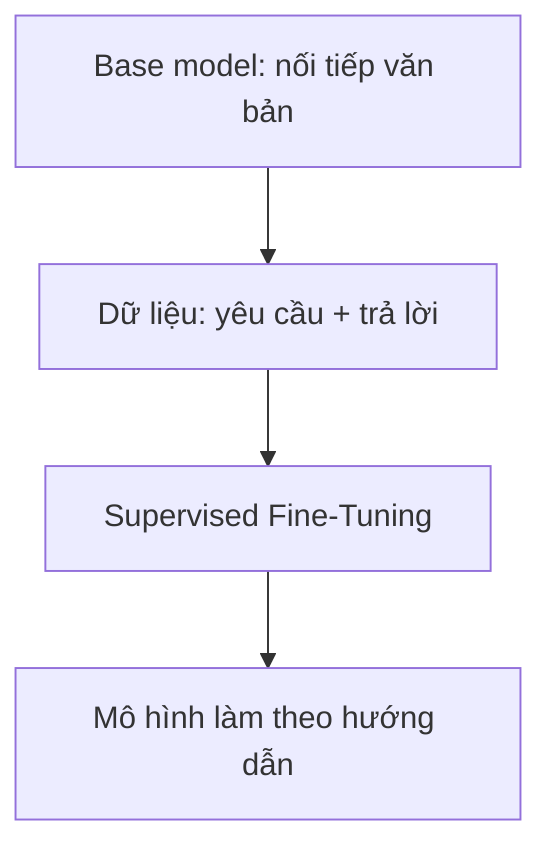

# Supervised Fine-Tuning (SFT): Dạy LLM biết làm theo hướng dẫn

## 1. SFT giải quyết vấn đề gì?

Một base model vừa hoàn thành pre-training chưa thật sự là trợ lý. Nó giống một học sinh đã đọc rất nhiều sách nhưng chưa được dạy cách trả lời người dùng.

Nhiệm vụ gốc của nó chỉ là:

> Nhìn các token phía trước và đoán token tiếp theo.

Ví dụ, khi nhận được:

```text
Thủ đô của Việt Nam là gì?
```

base model có thể nối tiếp thành:

```text
A. Hà Nội
B. Đà Nẵng
C. Thành phố Hồ Chí Minh
```

Nó không cố tình né câu hỏi. Trong dữ liệu Internet, câu hỏi kiểu này thường xuất hiện trong đề trắc nghiệm, nên việc tạo thêm các đáp án là một cách nối văn bản hợp lý.

**Supervised Fine-Tuning (SFT)** giúp thay đổi hành vi đó. Ta đưa cho mô hình nhiều ví dụ gồm:

```text
(yêu cầu của người dùng, câu trả lời mẫu)
```

Ví dụ:

```text
Yêu cầu: Giải thích lực hấp dẫn cho học sinh lớp 6.
Trả lời: Lực hấp dẫn là lực kéo mọi vật về phía Trái Đất...
```

Mô hình học cách bắt chước những câu trả lời tốt. Có thể hình dung:

- **Pre-training:** đọc cả thư viện để học ngôn ngữ và kiến thức.
- **SFT:** học với một bộ bài mẫu để biết cách trả lời đúng vai trò.



---
