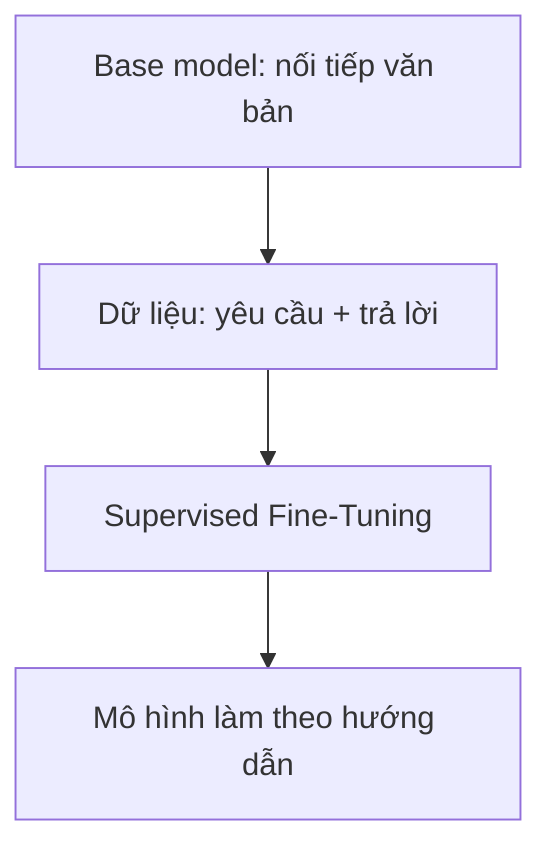

# Supervised Fine-Tuning (SFT): Dạy LLM biết làm theo hướng dẫn

## 1. SFT giải quyết vấn đề gì?

Một base model vừa hoàn thành pre-training chưa thật sự là trợ lý. Nó giống một học sinh đã đọc rất nhiều sách nhưng chưa được dạy cách trả lời người dùng.

Nhiệm vụ gốc của nó chỉ là:

> Nhìn các token phía trước và đoán token tiếp theo.

Ví dụ, khi nhận được:

```text
Thủ đô của Việt Nam là gì?
```

base model có thể nối tiếp thành:

```text
A. Hà Nội
B. Đà Nẵng
C. Thành phố Hồ Chí Minh
```

Nó không cố tình né câu hỏi. Trong dữ liệu Internet, câu hỏi kiểu này thường xuất hiện trong đề trắc nghiệm, nên việc tạo thêm các đáp án là một cách nối văn bản hợp lý.

**Supervised Fine-Tuning (SFT)** giúp thay đổi hành vi đó. Ta đưa cho mô hình nhiều ví dụ gồm:

```text
(yêu cầu của người dùng, câu trả lời mẫu)
```

Ví dụ:

```text
Yêu cầu: Giải thích lực hấp dẫn cho học sinh lớp 6.
Trả lời: Lực hấp dẫn là lực kéo mọi vật về phía Trái Đất...
```

Mô hình học cách bắt chước những câu trả lời tốt. Có thể hình dung:

- **Pre-training:** đọc cả thư viện để học ngôn ngữ và kiến thức.
- **SFT:** học với một bộ bài mẫu để biết cách trả lời đúng vai trò.



---

## 2. SFT hoạt động như thế nào?

LLM không nhận riêng một ô “câu hỏi” và một ô “câu trả lời”. Nó nhận một chuỗi token liên tục. Vì vậy, ta ghép hai phần bằng **chat template**:

```text
<|user|> Thủ đô của Việt Nam là gì? <|end|>
<|assistant|> Thủ đô của Việt Nam là Hà Nội. <|end|>
```

Các token đặc biệt có vai trò như biển báo:

| Token | Ý nghĩa |
|---|---|
| `<|user|>` | Người dùng bắt đầu nói |
| `<|assistant|>` | Đến lượt trợ lý trả lời |
| `<|end|>` | Kết thúc một lượt nói |

Quy trình tổng quát:

1. Chuẩn bị nhiều cặp `prompt` và `response` chất lượng cao.
2. Ghép chúng theo chat template của mô hình.
3. Tokenizer đổi văn bản thành các số nguyên gọi là `input_ids`.
4. Mô hình dự đoán token tiếp theo ở từng vị trí.
5. Chỉ tính lỗi trên phần trả lời của trợ lý.
6. Backpropagation cập nhật trọng số để lần sau mô hình trả lời gần mẫu hơn.

Điểm số 5 là phần quan trọng nhất của SFT.

---

## 3. Cross-Entropy Loss là gì?

Mỗi lần đoán token tiếp theo, mô hình tạo một điểm số cho mọi token trong từ điển. `softmax` biến các điểm số này thành xác suất.

Giả sử đáp án đúng là token `Hà_Nội`:

| Mô hình dự đoán | Xác suất của `Hà_Nội` | Kết quả |
|---|---:|---|
| Rất tự tin và đúng | 0.90 | Loss nhỏ |
| Không chắc chắn | 0.40 | Loss vừa |
| Gần như chọn sai | 0.01 | Loss rất lớn |

Loss của token đúng được tính bằng:

$$
L = -\log(p)
$$

Trong đó $p$ là xác suất mô hình dành cho token đúng.

Ví dụ:

| $p$ | $-\log(p)$ | Diễn giải |
|---:|---:|---|
| 0.90 | 0.105 | Đoán tốt |
| 0.50 | 0.693 | Chưa chắc |
| 0.01 | 4.605 | Đoán rất tệ |

Hãy xem loss như **điểm phạt vì bất ngờ**: mô hình càng bất ngờ trước đáp án đúng thì bị phạt càng nhiều.

Với cả câu trả lời, ta lấy trung bình loss của các token cần học:

$$
\mathcal{L}_{\text{SFT}}
= -\frac{1}{|y|}\sum_{t=1}^{|y|}
\log P_\theta(y_t\mid x,y_{<t})
$$

Đọc công thức bằng lời:

- $x$: yêu cầu của người dùng;
- $y_t$: token đúng thứ $t$ trong câu trả lời;
- $y_{<t}$: những token trả lời đứng trước nó;
- $P_\theta$: xác suất do mô hình hiện tại dự đoán;
- tổng chỉ chạy trên **các token thuộc câu trả lời**.

---

## 4. Bí quyết quan trọng: Loss Masking

Nếu tính loss trên toàn bộ cuộc hội thoại, mô hình còn bị yêu cầu học cách tạo ra câu hỏi của người dùng. Đó không phải mục tiêu chính của trợ lý.

Ta giải quyết bằng hai tensor:

- `input_ids`: chứa toàn bộ cuộc hội thoại để mô hình có đủ ngữ cảnh.
- `labels`: cho biết những token nào được dùng để chấm điểm.

Ở các vị trí không muốn chấm, ta đặt label bằng `-100`. Theo mặc định, `CrossEntropyLoss` của PyTorch bỏ qua nhãn này.

Ví dụ đã đơn giản hóa:

| Token | `input_ids` | `labels` | Tính loss? |
|---|---:|---:|:---:|
| `<|user|>` | 10 | -100 | Không |
| `2` | 21 | -100 | Không |
| `+` | 22 | -100 | Không |
| `3` | 23 | -100 | Không |
| `<|assistant|>` | 11 | -100 | Không |
| `5` | 25 | 25 | Có |
| `<|end|>` | 12 | 12 | Có |

Điều đáng nhớ:

> `-100` không xóa prompt khỏi đầu vào. Mô hình vẫn đọc prompt, nhưng không bị chấm điểm vì đã dự đoán các token thuộc prompt.

Token `<|end|>` trong phần trả lời vẫn được chấm để mô hình học lúc nào cần dừng.

---
